# Ho:YAG thin-disk laser — model, results and validation

This repository reconstructs and extends a Ho:YAG laser model into a **10 mm diameter × 1 mm thin-disk resonator** with picosecond pumping, four-manifold gain dynamics, a finite cooling plate, thermoelastic deformation, photoelasticity and a self-consistent vector hot-cavity calculation.

The numerical core has passed the Stage 0–7 software/physics audit and API-0.8 corrections. The current reference solution is suitable for numerical research and sensitivity studies, but it is **not yet an experimentally calibrated digital twin** and is **not yet qualified as ground truth for NN/SLM training**. Full mesh/mode-count refinement and calibration of the real crystal–bond–cooler assembly remain required.

---

## 1. Reference laser and cooling assembly

| Quantity | Reference value |
|---|---:|
| Active medium | Ho:YAG |
| Crystal | **10 mm diameter × 1 mm thickness** |
| Ho density | **1.52 × 10²⁶ m⁻³**, uniform in the current coupled reference |
| Pump | **1907.7 nm, 10 ps FWHM, 1 mJ, 10 kHz** |
| Incident average pump power | **10 W** |
| Pump 1/e² radius | **0.5 mm** |
| Laser wavelength | **2090.3 nm** |
| Disk rear signal reflectivity | **99.95%** |
| Disk rear pump reflectivity | **99.5%** |
| Air gap | **250 mm** |
| Output coupler | **500 mm ROC, 2% transmission** |
| Other signal loss | **0.5% per round trip** |
| Cooling plate | **20 mm diameter × 3 mm copper**, illustrative |
| Coolant reference | **293.15 K** |
| Crystal–plate thermal conductance | **1 × 10⁵ W m⁻² K⁻¹**, assumed |
| Plate–coolant conductance | **1 × 10⁴ W m⁻² K⁻¹**, assumed |

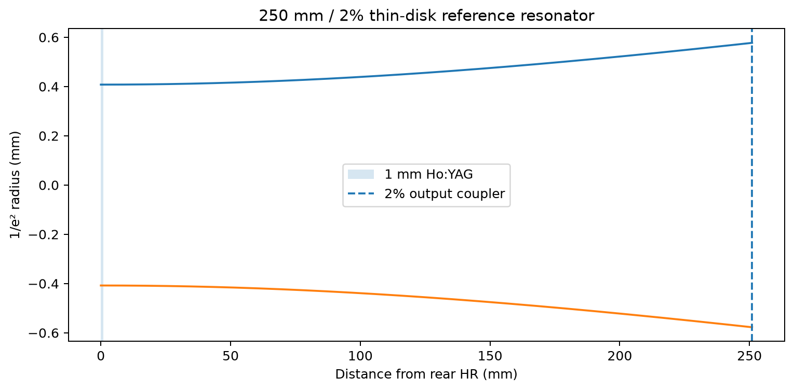

The plane rear coating of the disk is one resonator mirror. The signal crosses the crystal twice per round trip. The cooling plate is represented as a finite thermal and mechanical body rather than a fixed-temperature boundary.

---

## 2. Coupled physics

The current Stage 7 closure is

\[
\mathbf E(x,y)
\rightarrow N_i(r,\phi,z,t)
\rightarrow Q(r,\phi,z)
\rightarrow T_\mathrm{crystal},T_\mathrm{plate}
\rightarrow \boldsymbol{\sigma},\mathbf u
\rightarrow \mathbf J_\mathrm{hot}(x,y)
\rightarrow \mathbf E'(x,y).
\]

Implemented layers include passive diffraction/GVD, four Ho manifolds, repetitive picosecond pumping, structured-light gain/depletion, the HR-backed resonator, energy-consistent lattice heating, finite crystal/plate heat diffusion, compliant crystal–plate mechanics, surface deformation, photoelastic Jones matrices and iterative vector eigenfields.

Stage 7 is an **adiabatic cycle-averaged spatial-mode closure**: the spatial field is held fixed during one fast pump-cycle rate solve and updated on the slower outer loop. It is not carrier-resolved Maxwell–Bloch/FDTD.

---

## 3. Ho distribution and excitation

The current coupled reference uses a uniform total Ho density inside the physical disk:

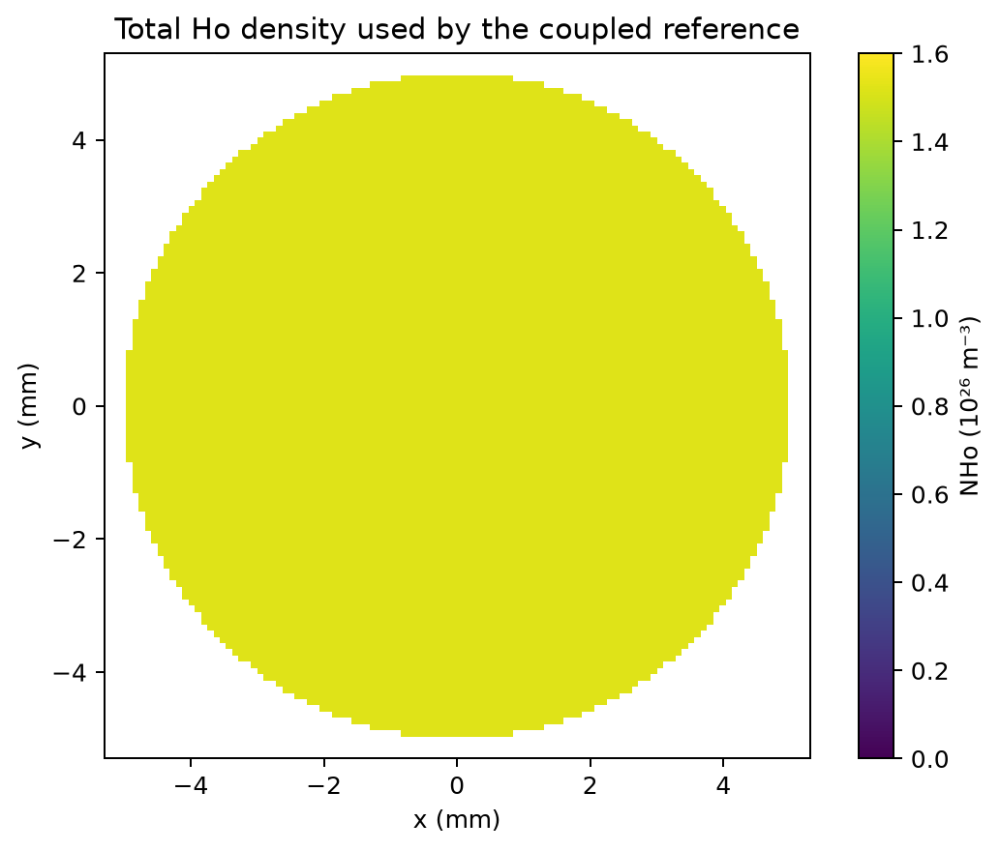

The optical solver then predicts where those Ho ions occupy the upper laser manifold:

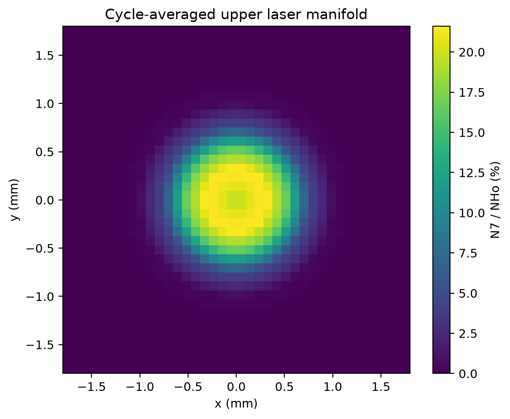

These panels are different quantities: the first is the **material concentration** \(N_\mathrm{Ho}\), while the second is the cycle-averaged **excited population fraction** \(N_7/N_\mathrm{Ho}\).

---

## 4. Incoming pump and outgoing laser beam

The reference source is a 1907.7 nm Gaussian pump with 0.5 mm 1/e² radius, 1 mJ pulse energy and 10 kHz repetition rate.

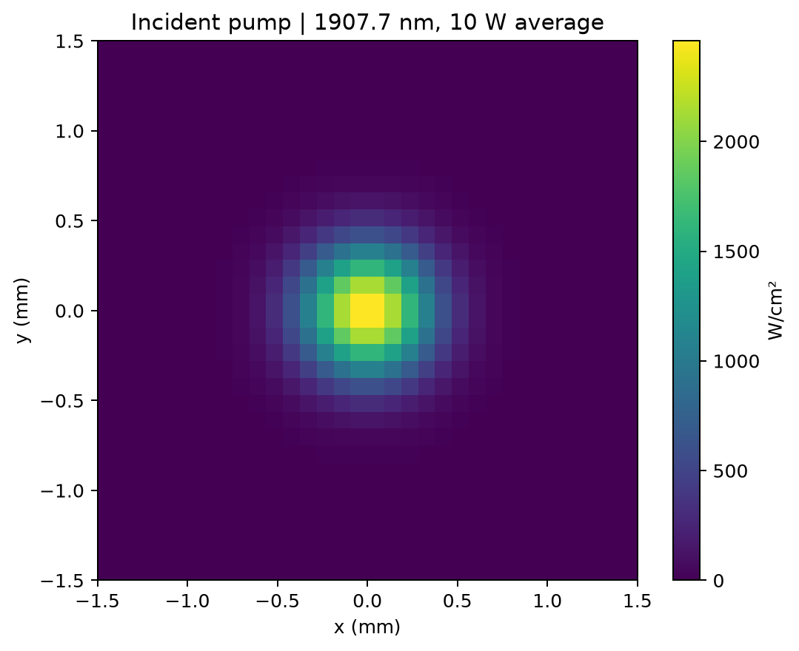

The Stage 7 resonator field is a complex two-polarization eigenfield rather than a Gaussian fit:

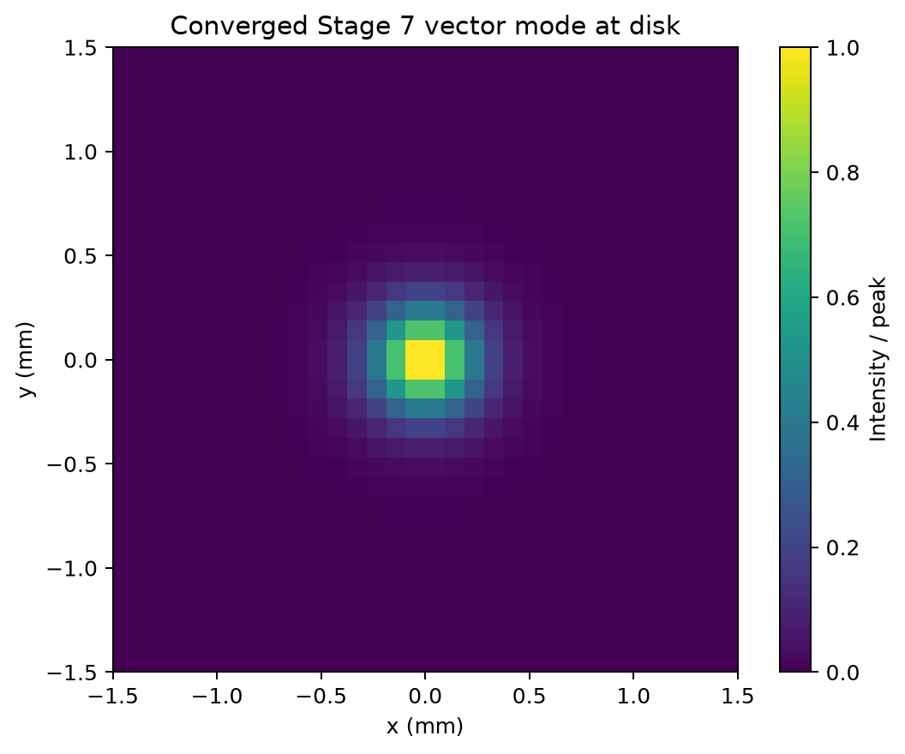

For the audited coarse-grid reference, the useful cycle-averaged laser output is

\[
\boxed{P_\mathrm{out}=0.7530128\ \mathrm{W}}.
\]

The README build post-processes the archived converged field through the archived final hot optical state and scales the profile to that archived power. It does not execute a second nonlinear laser solution.

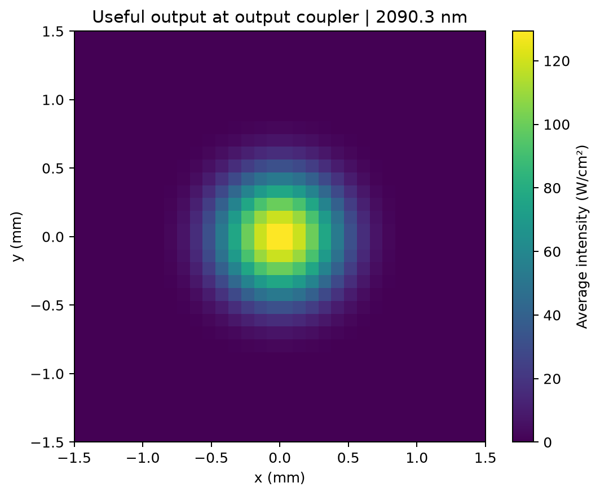

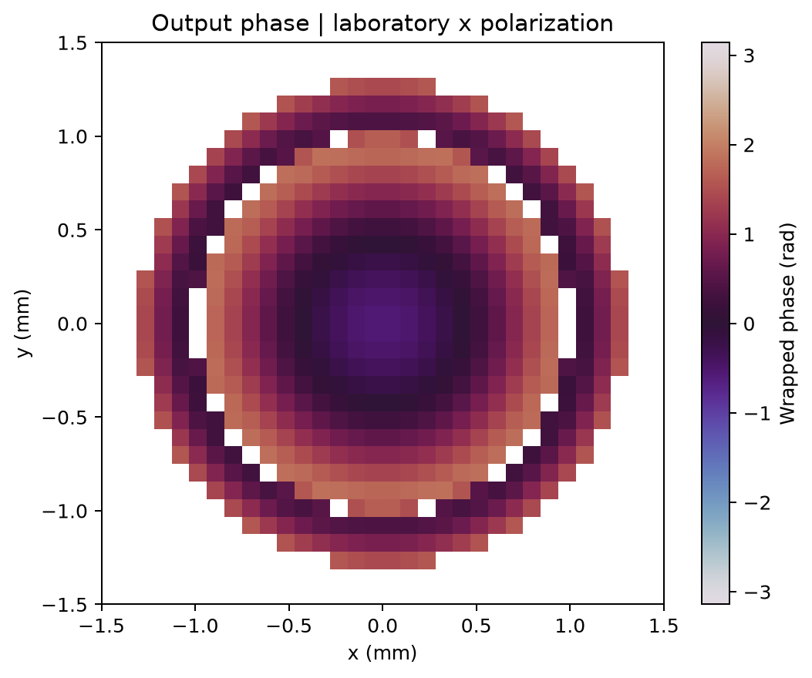

Global optical phase is arbitrary; the phase map masks low-intensity pixels.

---

## 5. Energy flow and heat generation

The local small-signal coefficient is

\[
g=\sigma_{e,L}N_7-\sigma_{a,L}N_8.
\]

The lattice heat ledger is

\[
Q_\mathrm{lattice}
=
P_\mathrm{pump,net}
-
P_\mathrm{stimulated}
-
P_\mathrm{fluorescence}
-
\frac{\partial U_\mathrm{ions}}{\partial t}.
\]

For the audited 10 W reference:

| Cycle-averaged quantity | Power |
|---|---:|
| Incident pump | **10.000000 W** |
| Pump absorbed in crystal | **2.205720 W** |
| Pump escaping | **7.750210 W** |
| Pump mirror/relay loss | **0.044070 W** |
| Stimulated transfer to signal | **0.958425 W** |
| Fluorescence leaving ionic subsystem | **0.574883 W** |
| Deposited lattice heat | **0.671996 W** |
| Residual ionic-storage change | **0.000346 W** |
| Useful output-coupler power | **0.753013 W** |

Stimulated transfer and useful output are not independent terms in one pump partition; intracavity loss and photon storage lie between them.

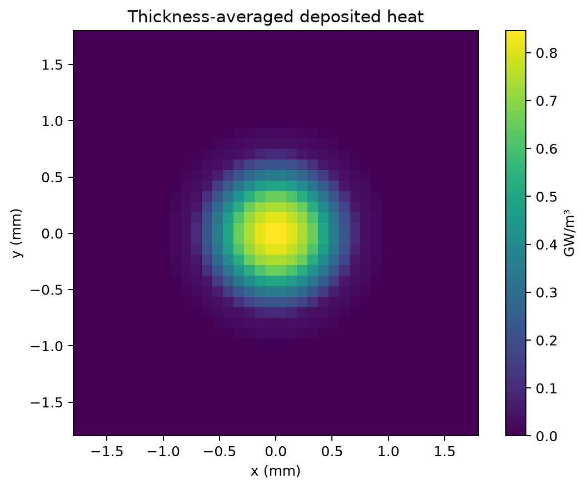

---

## 6. Crystal and cooling-plate thermal simulation

The two solids satisfy

\[
\rho C_p\frac{\partial T}{\partial t}
=
\nabla\cdot(k\nabla T)+Q.
\]

Heat crosses the crystal–plate interface through a finite conductance and crosses the plate–coolant boundary through another finite conductance.

For the archived final relaxed heat source:

- maximum crystal cell temperature: **302.36 K = 29.21 °C**;
- maximum copper-plate temperature: **293.67 K = 20.52 °C**.

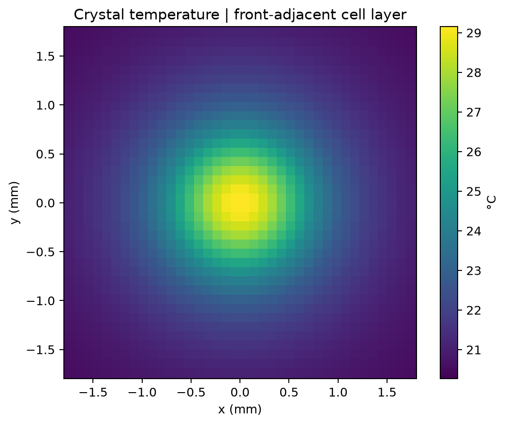

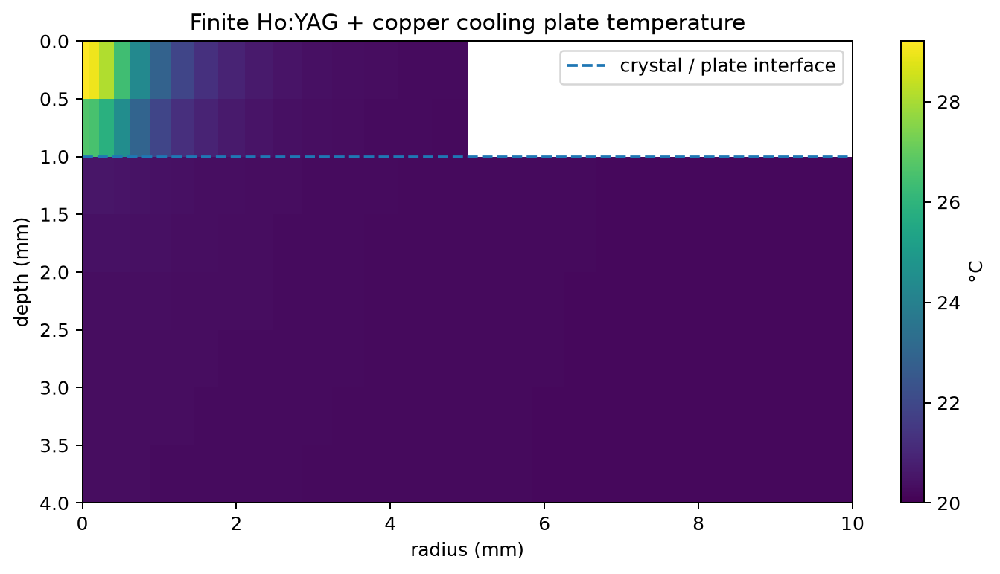

The plate is therefore neither rigid nor isothermal. The contact and coolant conductances are assumptions until calibrated to the real mount.

---

## 7. Thermo-mechanical deformation

Both crystal and plate satisfy linear thermoelastic equilibrium,

\[
\nabla\cdot\boldsymbol{\sigma}=0,
\qquad
\boldsymbol{\sigma}
=
\mathbf C:
\left[
\boldsymbol{\varepsilon}
-
\alpha(T-T_0)\mathbf I
\right].
\]

A compliant bond transfers normal and shear traction. The crystal rear face is not directly fixed.

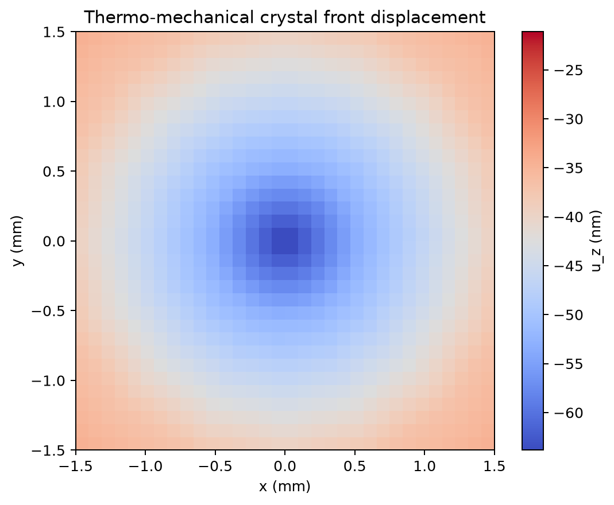

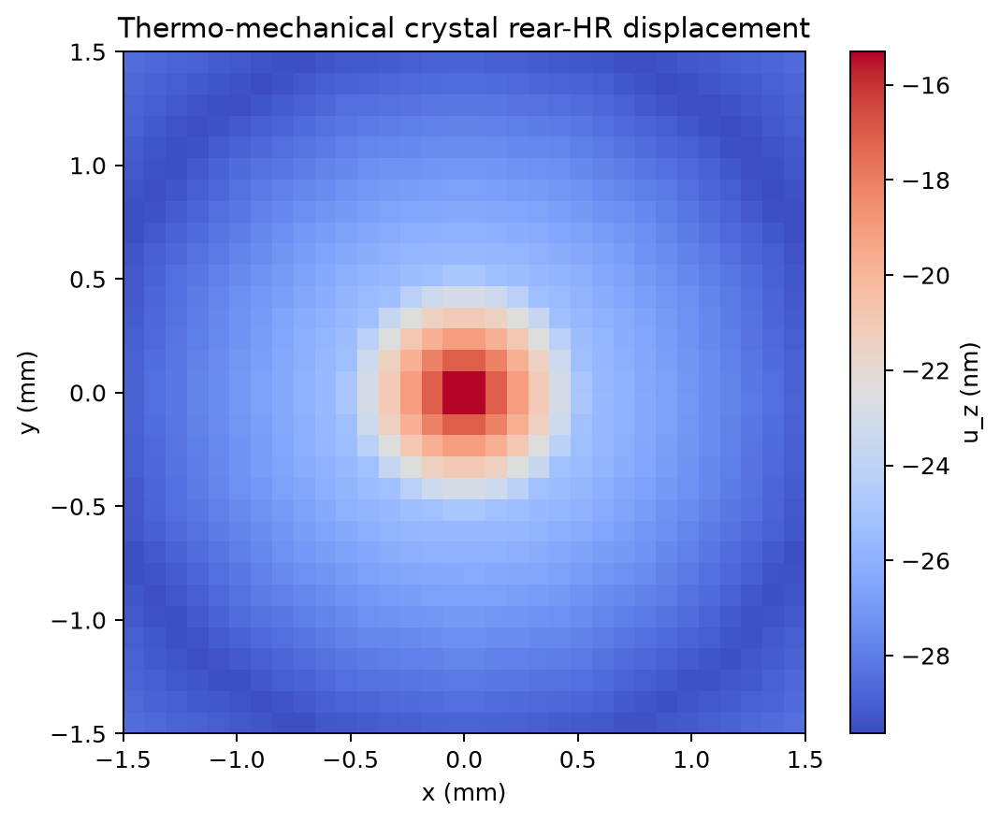

Positive \(z\) points from the optical front into the cooling plate. The interface is currently a **bilateral compliant bond**; opening, Coulomb friction, delamination, solder plasticity and creep are not solved.

---

## 8. Hot-disk optical-path distortion

The reflected optical distortion includes:

1. thermo-refractive index change;
2. motion of both crystal surfaces;
3. stress-induced photoelasticity/birefringence.

For the rear-coated disk, the geometric reflected optical path is

\[
\Delta\mathrm{OPD}_\mathrm{geom}
=
2\left[(1-n)u_{\mathrm{front},z}+n\,u_{\mathrm{rear},z}\right].
\]

Thus twice the front-surface bulge is not sufficient.

The photoelastic response is an ordered two-polarization Jones operator. Current photoelastic coefficients are host-YAG reference values, not a complete measured Ho:YAG 2.09 µm tensor.

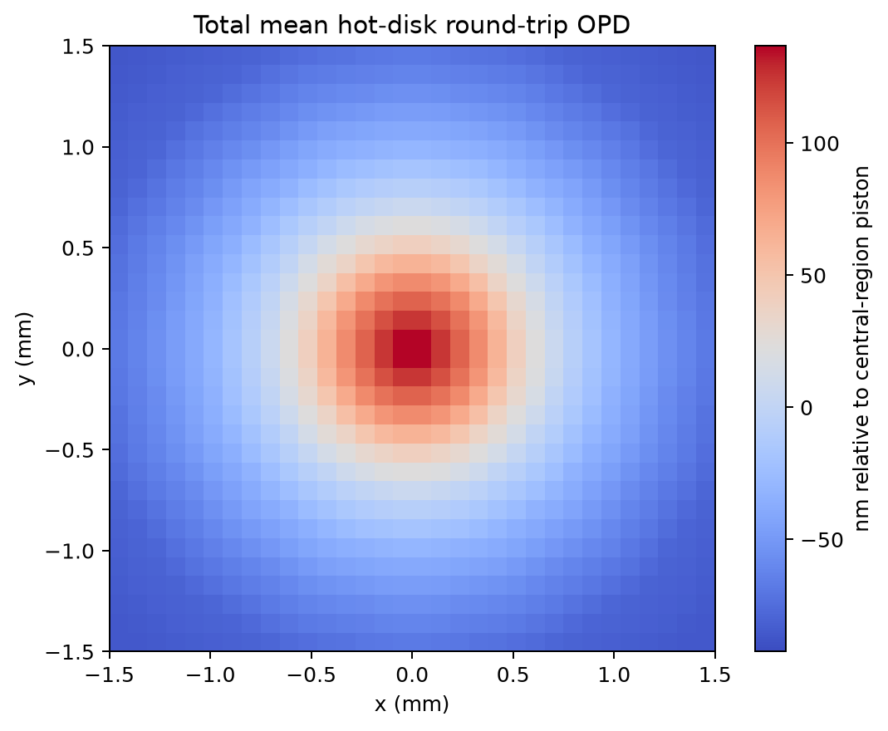

---

## 9. Coupled hot-cavity convergence

The outer loop recomputes

\[
\mathbf E
\rightarrow N_i
\rightarrow Q
\rightarrow T
\rightarrow (\boldsymbol{\sigma},\mathbf u)
\rightarrow \mathbf E_\mathrm{new}.
\]

The corrected audited reference converged in **six outer iterations**:

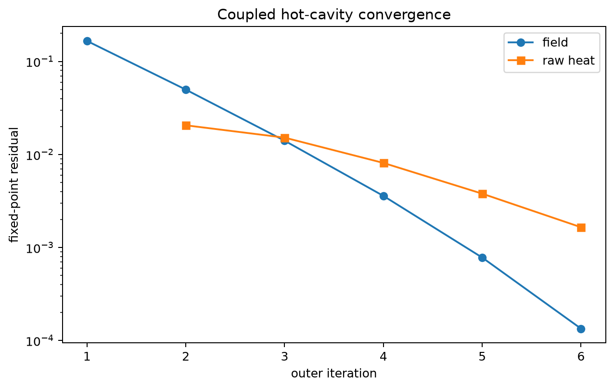

| Residual | Final value |
|---|---:|
| Phase-aligned vector-field residual | **1.34 × 10⁻⁴** |
| Unrelaxed heat-source residual | **1.65 × 10⁻³** |
| Maximum temperature change | **6.68 × 10⁻³ K** |
| Maximum displacement change | **5.67 × 10⁻¹¹ m** |
| Output-power relative change | **2.61 × 10⁻⁴** |
| Full-grid eigenpair residual | **4.39 × 10⁻¹⁴** |

These establish fixed-point convergence on the selected discretization, not complete mesh or mode-count convergence.

---

## 10. Temporal output

The pump pulse is 10 ps, but the model contains no mode-locking mechanism. The optical output therefore need not be picosecond.

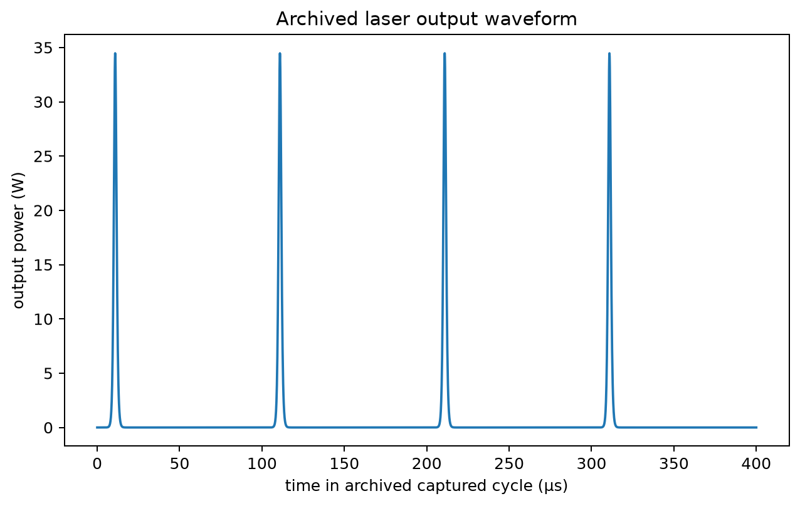

The plotted waveform is the archived cycle from the corrected Stage 7 reference.

---

## 11. Seeded spiral-light diagnostic

A seeded vortex amplifier test and spontaneous free-running vortex selection are different questions.

The following uses the final archived hot operator with a seeded \(LG_0^1\) input at the cavity waist:

| Input | Output after one hot round-trip operator |
|---|---|
| 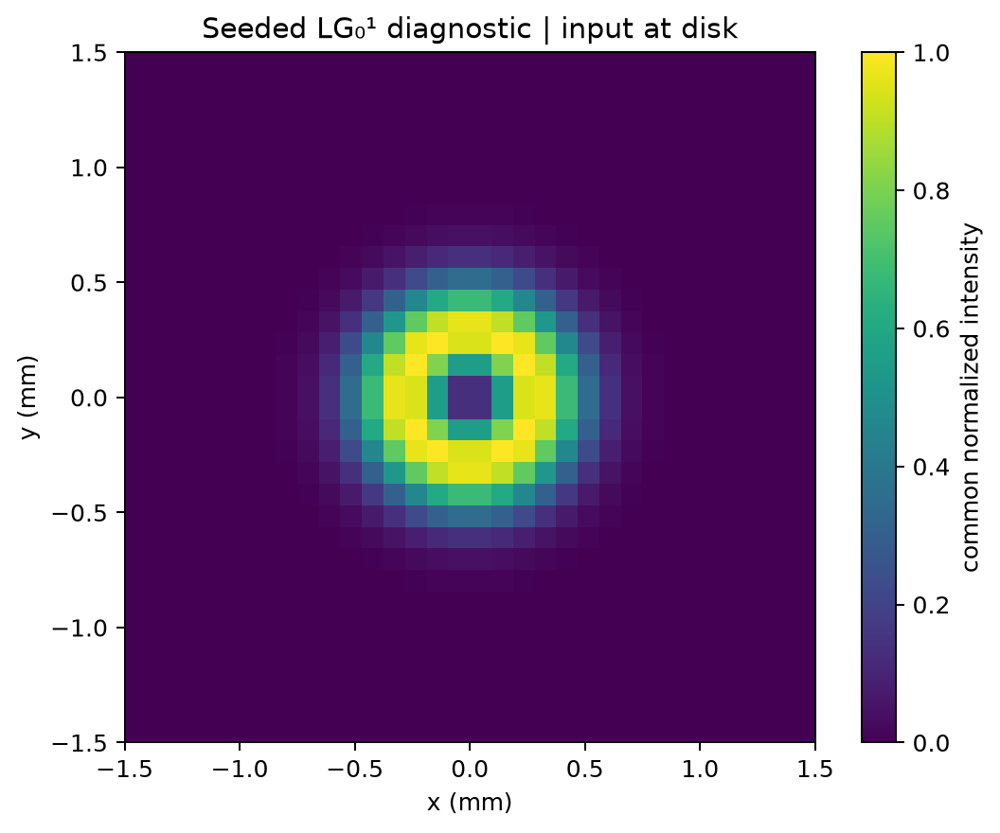 | 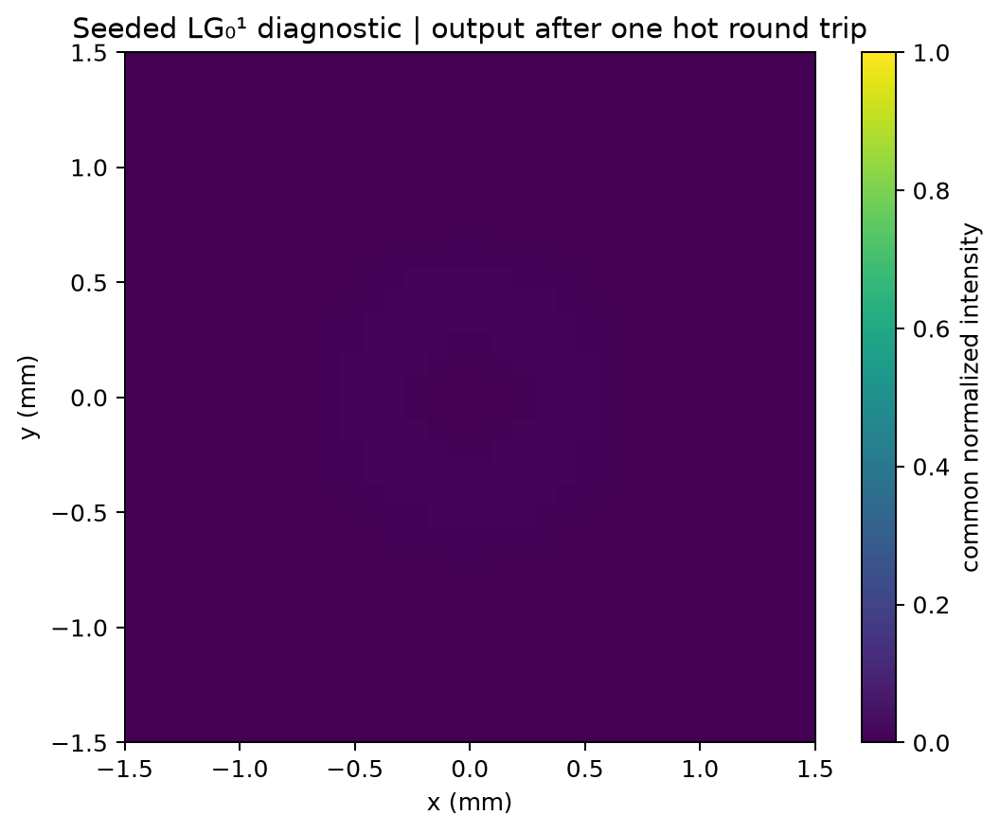 |

This is a weak seeded diagnostic. It is **not evidence that the free-running resonator selects stable LG₀¹ lasing**. Multiple retained eigenbranches are supported, but complete multimode stability and mode-count refinement remain outstanding.

---

## 12. Audit and software status

A deep Stage 0–7 audit found real software/interface defects, including population-axis mismatch, phase loss in a weak-reference diagnostic, pump-duration/spectrum decoupling, FFT detuning-sign inconsistency, insufficient parameter validation, unsafe evanescent evaluation and density-statistics violations.

Those defects were corrected in API 0.8.

The correction campaign recorded:

- **219 tests passed**;
- **19 independent audit probes passed**;
- the corrected 10 W Stage 7 reference again converged in six outer iterations.

Relevant documents:

- docs/AUDIT_STAGE0_7_20260922.md — original failure report;
- docs/AUDIT_FIXES_STAGE0_7.md — corrections and migration;
- docs/STAGE7.md — coupled hot-cavity definition;
- docs/STAGE6.md — crystal/cooling-plate mechanics;
- docs/STAGE5.md — heat and thermo-optic model.

---

## 13. Remaining limitations

This model is not yet a hardware-calibrated digital twin.

Key unresolved items:

- full optical/material/mechanical mesh refinement;
- retained-mode completeness and nonlinear multimode stability;
- coherent mode beating and round-trip-by-round-trip transverse mode evolution;
- measured crystal–plate thermal contact, bond stiffness, preload and coolant coupling;
- unilateral contact/opening/friction/delamination/plasticity;
- complete temperature-dependent Ho:YAG spectroscopy;
- radiation trapping and fluorescence reabsorption;
- coating absorption/heating and coating-layer stress;
- a fully validated Ho:YAG photoelastic tensor at 2.09 µm;
- fully spectrally resolved saturated broadband pump propagation.

For these reasons, the project still marks the current hot-cavity state as **not yet qualified for NN training-label generation**.

---

## 14. Figure provenance

The figures in this README are regenerated in GitHub Actions from the exact audited Stage 7 verification artifact produced by the API-0.8 correction workflow.

The documentation build:

1. downloads that immutable Actions artifact;
2. copies the compact Stage 7 summary/history/audit record into docs/results_readme/data;
3. uses its archived converged field, populations and heat;
4. recomputes the finite crystal/plate thermo-mechanical state required for visualization using the current Stage 6 implementation;
5. post-processes the archived field through the final hot optical operator;
6. records SHA-256 provenance;
7. does **not** solve a new nonlinear oscillator fixed point.

Raw multi-megabyte NPZ arrays remain in the Actions artifact rather than being duplicated in the repository.

See docs/results_readme/figures/manifest.json and docs/results_readme/data/derived_metrics.json.

---

## 15. Reproduce

Clone the repository and install:

    git clone https://github.com/aidasmik/Ho-YAG-crystal.git
    cd Ho-YAG-crystal
    python -m pip install -e '.[dev,plots]'

Run the full tests and independent audit:

    python -m pytest -q
    python audit/deep_check.py

Run the coarse coupled reference:

    python examples/stage7_hot_cavity.py --quick --require-converged --output results/stage7/demo

The README figures can be rebuilt from the unpacked audited Actions artifact:

    python docs/results_readme/generate.py \
      --artifact-root /path/to/unpacked/audited/artifact \
      --output docs/results_readme

---

## 16. Core reference

M. Rupp, M. Eichhorn, C. Kieleck, *Iterative 3D modeling of thermal effects in end-pumped continuous-wave Ho³⁺:YAG lasers*, **Applied Physics B 129, 4 (2023)**, DOI 10.1007/s00340-022-07939-z.

That paper validated a different CW rod geometry. It does **not** directly validate the reconstructed picosecond-pumped thin-disk system documented here.
