# Ho:YAG thin-disk laser — model, results and validation

**Yb:YAG:** The [complete Yb:YAG data and simulator guide](Yb-YAG/README.md)
contains source spectra, equations, reproduction commands, generated figures and
limitations. A shorter explanation follows below.

This repository reconstructs and extends a Ho:YAG laser model into a **10 mm diameter × 1 mm thin-disk resonator** with picosecond pumping, four-manifold gain dynamics, a finite cooling plate, thermoelastic deformation, photoelasticity and a self-consistent vector hot-cavity calculation.

For the separate Yb:LuAG active-medium implementation, see [Yb:LuAG replacement](docs/YBLUAG_REPLACEMENT.md). It provides two-manifold CW pump/signal propagation with the Yb:LuAG spectral data; the Ho:YAG coupled-resonator results below remain Ho:YAG results.

The Yb:LuAG [audit implementation and validation status](docs/YBLUAG_AUDIT_FIXES.md)
separates numerically checked propagation and population behavior from
engineering approximations and missing experimental inputs. Its 96² optical
grid is a preview, not a convergence-tested device prediction. Hot-cavity
thermal feedback, calibrated coating losses, photoelasticity and
concentration-dependent refractive index remain unavailable.

## Yb:YAG thin-disk amplifier in brief

The Yb:YAG model sends a shaped **1030 nm, 10 ps seed** through one 100 µm disk
up to ten times while a separate **969 nm continuous-wave pump** excites the
same Yb population. A phase-only SLM shapes the seed before it diffracts to the
disk. Pump absorption and signal extraction also provide heat input to a finite
disk, contact and copper-cooler calculation. The relay in this diagram is an
ideal optical boundary condition, not a constructed multipass layout.


### Spectra, concentration and light transport

The default calculation uses a **293.15 K**, 191-point absorption/emission
cross-section table. The pump and signal wavelengths are sampled from those
curves. Optional literature-derived temperature and ceramic concentration
spectra are shown separately in the [full guide](Yb-YAG/README.md#what-data-are-used-now);
they are not silently substituted for the default table.


Nominal doping is atomic percent of Y sites. The code converts it to ion density
as `N = (3 rho_YAG / M_YAG) N_A (at.% / 100)`. For local upper-manifold fraction
`beta`, each optical cell uses

```text
pump absorption: alpha_p = N[(1-beta) sigma_a,p - beta sigma_e,p]
signal gain:     g_s     = N[beta sigma_e,s - (1-beta) sigma_a,s]
I_p,out = I_p,in exp(-alpha_p Delta z);  I_s,out = I_s,in exp(g_s Delta z).
```

The pump alternates direction across axial passes, with relay loss; its
cell-average intensity sets excitation rates. The population bleaches pump
absorption, is depleted by seed extraction, and recovers between pulses. The
solver repeats seed periods until the pre-pulse population becomes periodic.
All signal traversals use **one shared crystal**, not ten independent gain
stages.

Synthetic doping has two paths: the gallery can draw seeded **3D rich/poor
clusters**; the camera dataset and controller instead draw a fixed smooth **2D
map** for each virtual crystal and set the 3D cluster contrast to zero. The
default 2D map is a Gaussian-filtered, zero-mean, unit-RMS random field with
`s_Yb = max(0.1, 1 + 0.03 u)`. Local density is `N_local = N_nominal s_Yb`
(times the optional 3D multiplier), and a separate thickness scale multiplies
each cell's optical depth. The same Yb map also changes the approximate local
thermal conductivity. These are generated imperfections, not measured maps.


For the illustrated 10 at.% map, active-disk concentrations span about
**9.21–10.55 at.%** and the *unpumped, frozen-population* 969 nm one-pass
transmission is **0.911–0.922**. The working amplifier is different: its
population, pump bleaching and signal gain change during repeated encounters.
The full guide plots the [frozen transmission beside periodic solver results](Yb-YAG/README.md#how-light-crosses-varying-concentration).

### Example outputs and observations

In the coarse **cold optical** example, a 40 W pump and 10 nJ seed yield these
calculated pulse energies after ten signal traversals. Per-ion cross sections
are held fixed while nominal doping changes.

| Yb on Y sites | Pump absorbed | Output energy |
|---:|---:|---:|
| 5 at.% | 9.46 W | 14.01 nJ |
| 10 at.% | 17.10 W | 18.88 nJ |
| 15 at.% | 23.17 W | 24.36 nJ |
| 20 at.% | 27.87 W | 30.04 nJ |


Heat is computed from absorbed pump energy minus signal transfer,
fluorescence escape and stored-population change, then passed to a disk/plate
thermal and mechanical model. Its scalar phase screen can be applied to the
output in a near-room-temperature mode; **hot temperature feedback into gain
is unavailable**. A separate 0.1 W thermal example and its phase map are in
the [full guide](Yb-YAG/README.md#heat-cooler-and-phase).

The dataset can add fixed Yb, thickness, surface, contact, SLM and detector
imperfections; varying pump/seed conditions; and per-exposure jitter, Poisson
photoelectron counts, read noise and ADC clipping. Two camera planes,
four-step interferometry, temperature probes and a photodiode provide simulated
observations for control. The controller receives those measurements, while
the NN dataset explicitly includes the known relative Yb map in its inputs.
The [camera example](Yb-YAG/README.md#noise-cameras-and-control) shows one
noisy exposure of the calculated output.

**Scope:** these are sensitivity calculations, not calibrated predictions for
a particular crystal or laser. The default spectra lack sample-specific
uncertainty and hot pump-band data; the examples use coarse spatial/axial
grids, ideal relay optics and synthetic defect/noise maps. Hot gain, ASE,
nonlinear pulse effects and a validated device cooler are unresolved. Read the
[limitations](Yb-YAG/README.md#what-the-current-model-cannot-establish) before
using the figures for design or training targets.

To verify the source files and regenerate the figures from the repository root:

```bash
python -m pip install -e '.[plots,dev]'
python Yb-YAG/tools/verify_manifest.py
python examples/run_ybyag_readme_supervised.py
```

## Desktop calculator

For the new Yb:YAG material, launch `examples/ybyag_desktop.py`. It uses the
repository's `Yb-YAG/` dataset and defaults to 20 at.% Yb. See
[Yb:YAG implementation and physical limits](docs/YBYAG_SIMULATION.md).
Fully coupled hot YAG gain remains unavailable because temperature-dependent
pump spectra are missing; the native app offers cold and near-RT lumped-phase modes.

The Tkinter calculator has separate **Yb:YAG**, **Yb:LuAG** and **Ho:YAG** tabs. It runs the
existing solvers locally and displays maps and profiles inside the window.
The Yb tab offers the proposal pulse amplifier (including regenerative cavity),
structured CW passes, and a CW material/coating screen. The Ho tab offers weak
probe, modal thermal, and periodic seeded amplifier calculations. Calculations
use the shared `.local_runtime/budget.json` run ledger; the window shows the
per-run time and memory limits. There is no cumulative attempt cap. It does
not start a web server.

On Linux, install Tk for your system Python, then run:

```bash
.venv/bin/python -m pip install -e '.[desktop]'
.venv/bin/python examples/ybluag_desktop.py
```

The Yb launcher opens its native calculator with the latest saved Yb run. It
shows source, disk-input and output beams with adjacent horizontal and vertical
profiles; SLM phase and synthetic Yb maps; gain and pulse traces; and cooler
timelines and thermal surfaces where the solver provides them. Its five-point
pump curve recalculates the periodic optical state for the displayed pulse run
without rerunning the cooler. Use `examples/desktop_simulation.py` to open the
combined Yb and Ho desktop calculator with Ho selected first.

After a pulsed Yb result, **Export camera data (1080p)…** generates bounded,
reproducible monochrome frames with sensor noise and separate optical truth.
The **Camera preview** shows the clean fluence, noisy CCD image, beam profiles,
and the added phase residual against the saved field at the same camera plane.
The Yb:YAG **Correction loop** shows diagnostic-camera profiles and the output
phase residual against a uniform, cold-phase target during fitting and replay.
Its interferometric mode reconstructs a measured phase from four phase-shifted
camera exposures; the separate truth phase and ideal-compensation maps come
from the simulator and are never passed to the controller. SPGD remains a
separate chronological mode that records noisy updates and regressions.
See [the correction physics and code map](docs/YBYAG_CLOSED_LOOP.md).
See [camera data options and limitations](docs/YB_CAMERA_DATASET.md).
The Yb:YAG tab also offers a [grouped physical-disturbance NN dataset generator](docs/YBYAG_NN_DATASET.md)
with fresh solver runs, two camera planes and separate train/validation/test setups.

On Windows, launch the Yb window from the repository directory with:

```powershell
& 'C:\Users\Aidas\AppData\Local\Programs\Python\Python311\python.exe' .\examples\ybluag_desktop.py
```

The Yb input controls start with the ideal multipass architecture and a 25 °C
cooler target. A saved result can appear on opening, but it does not replace
the current input defaults. The Tkinter window runs bounded local workers and
does not require or start the browser server.

The pulsed pump default is 969 nm. Controls are grouped by seed/phase, Yb
crystal, pump/cooling, optics and numerical settings. See the
[25 September physics and desktop audit](docs/YBLUAG_PHYSICS_DESKTOP_AUDIT_20260925.md)
for conservation checks, the ten-traversal gain bound, and remaining physical limits.

On Windows, use a Python installation with Tk and replace `.venv/bin/python`
with its interpreter path. Results and execution logs are saved under
`results/desktop_runs/` for Yb and `results/structured_beams/runs/` for Ho.
The Yb spectra, lifetimes, cooling contact, coating and cavity parameters are
engineering assumptions described in `docs/YBLUAG_REPLACEMENT.md` and
`docs/YBLUAG_REGENERATIVE_MODEL.md`; the GUI does not make them measured data.

The numerical core has passed the Stage 0–7 software/physics audit and API-0.8 corrections. The current reference solution is suitable for numerical research and sensitivity studies, but it is **not yet an experimentally calibrated digital twin** and is **not yet qualified as ground truth for NN/SLM training**. Full mesh/mode-count refinement and calibration of the real crystal–bond–cooler assembly remain required.

---

## 1. Reference laser and cooling assembly

| Quantity | Reference value |
|---|---:|
| Active medium | Ho:YAG |
| Crystal | **10 mm diameter × 1 mm thickness** |
| Ho density | **1.52 × 10²⁶ m⁻³**, uniform in the current coupled reference |
| Pump | **1907.7 nm, 10 ps FWHM, 1 mJ, 10 kHz** |
| Incident average pump power | **10 W** |
| Pump 1/e² radius | **0.5 mm** |
| Laser wavelength | **2090.3 nm** |
| Disk rear signal reflectivity | **99.95%** |
| Disk rear pump reflectivity | **99.5%** |
| Air gap | **250 mm** |
| Output coupler | **500 mm ROC, 2% transmission** |
| Other signal loss | **0.5% per round trip** |
| Cooling plate | **20 mm diameter × 3 mm copper**, illustrative |
| Coolant reference | **293.15 K** |
| Crystal–plate thermal conductance | **1 × 10⁵ W m⁻² K⁻¹**, assumed |
| Plate–coolant conductance | **1 × 10⁴ W m⁻² K⁻¹**, assumed |

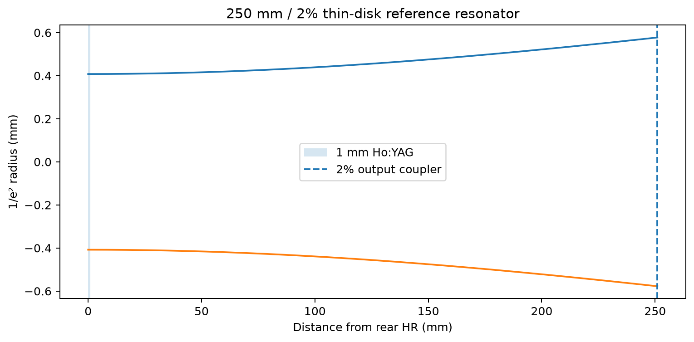

The plane rear coating of the disk is one resonator mirror. The signal crosses the crystal twice per round trip. The cooling plate is represented as a finite thermal and mechanical body rather than a fixed-temperature boundary.

---

## 2. Coupled physics

The separate Yb:LuAG amplifier's coupled ideal-multipass implementation and
remaining calibration limits are documented in
[Yb:LuAG remaining-model implementation](docs/YBLUAG_REMAINING_IMPLEMENTATION.md).

The current Stage 7 closure is

\[
\mathbf E(x,y)
\rightarrow N_i(r,\phi,z,t)
\rightarrow Q(r,\phi,z)
\rightarrow T_\mathrm{crystal},T_\mathrm{plate}
\rightarrow \boldsymbol{\sigma},\mathbf u
\rightarrow \mathbf J_\mathrm{hot}(x,y)
\rightarrow \mathbf E'(x,y).
\]

Implemented layers include passive diffraction/GVD, four Ho manifolds, repetitive picosecond pumping, structured-light gain/depletion, the HR-backed resonator, energy-consistent lattice heating, finite crystal/plate heat diffusion, compliant crystal–plate mechanics, surface deformation, photoelastic Jones matrices and iterative vector eigenfields.

Stage 7 is an **adiabatic cycle-averaged spatial-mode closure**: the spatial field is held fixed during one fast pump-cycle rate solve and updated on the slower outer loop. It is not carrier-resolved Maxwell–Bloch/FDTD.

---

## 3. Ho distribution and excitation

The current coupled reference uses a uniform total Ho density inside the physical disk:

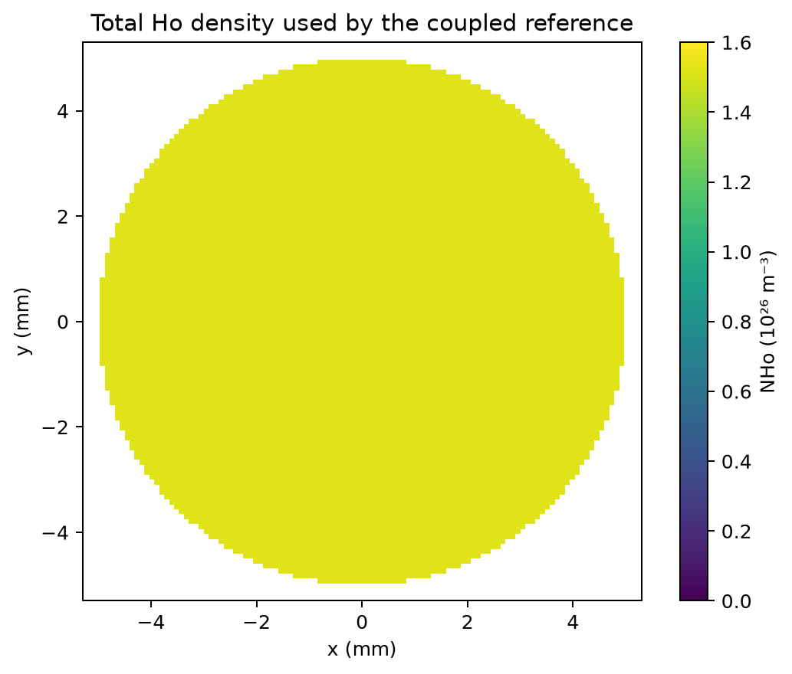

The optical solver then predicts where those Ho ions occupy the upper laser manifold:

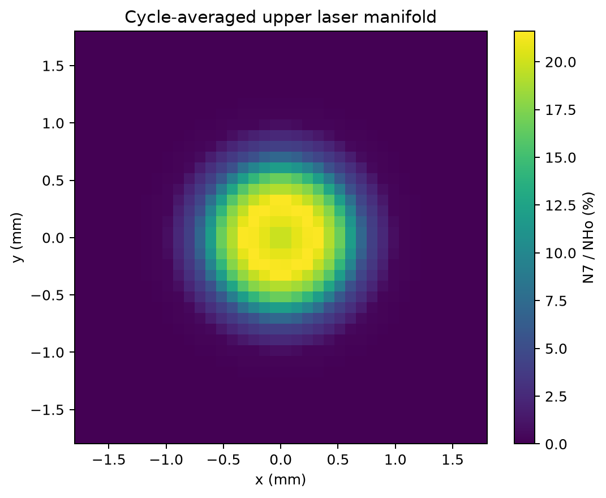

These panels are different quantities: the first is the **material concentration** \(N_\mathrm{Ho}\), while the second is the cycle-averaged **excited population fraction** \(N_7/N_\mathrm{Ho}\).

---

## 4. Incoming pump and outgoing laser beam

The reference source is a 1907.7 nm Gaussian pump with 0.5 mm 1/e² radius, 1 mJ pulse energy and 10 kHz repetition rate.

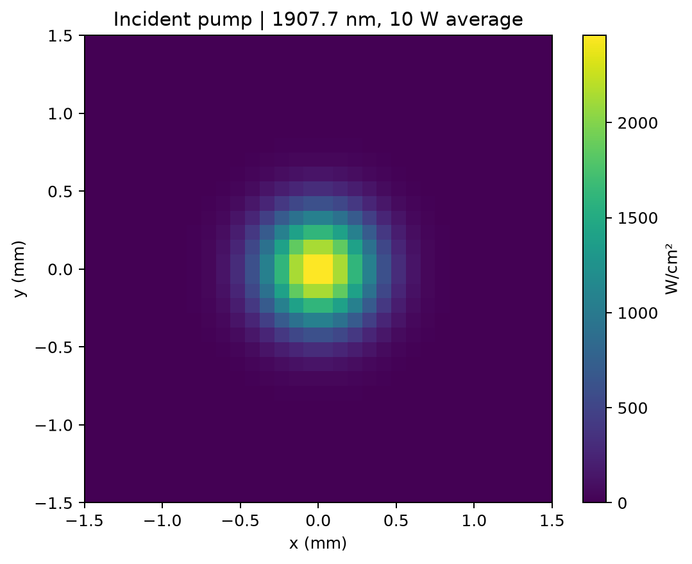

The Stage 7 resonator field is a complex two-polarization eigenfield rather than a Gaussian fit:

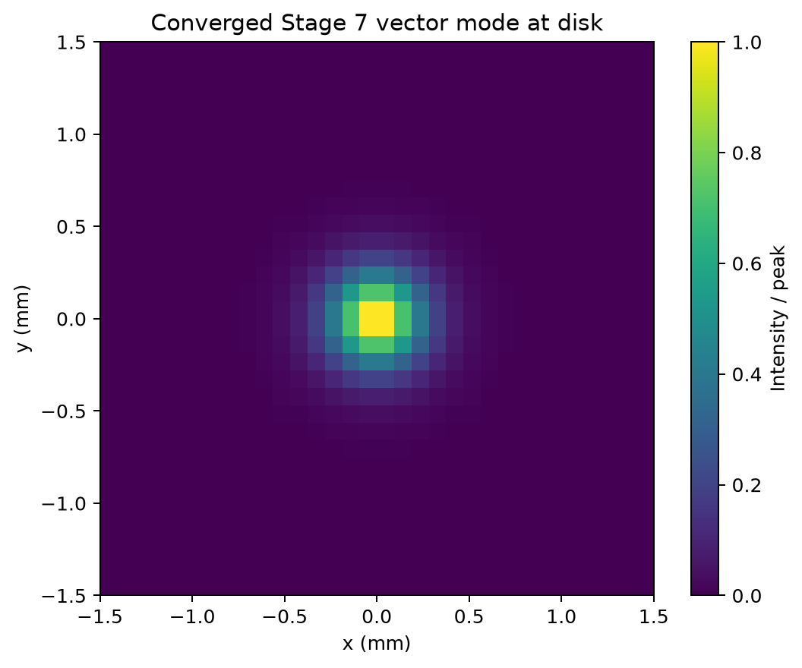

For the audited coarse-grid reference, the useful cycle-averaged laser output is

\[
\boxed{P_\mathrm{out}=0.7530128\ \mathrm{W}}.
\]

The README build post-processes the archived converged field through the archived final hot optical state and scales the profile to that archived power. It does not execute a second nonlinear laser solution.

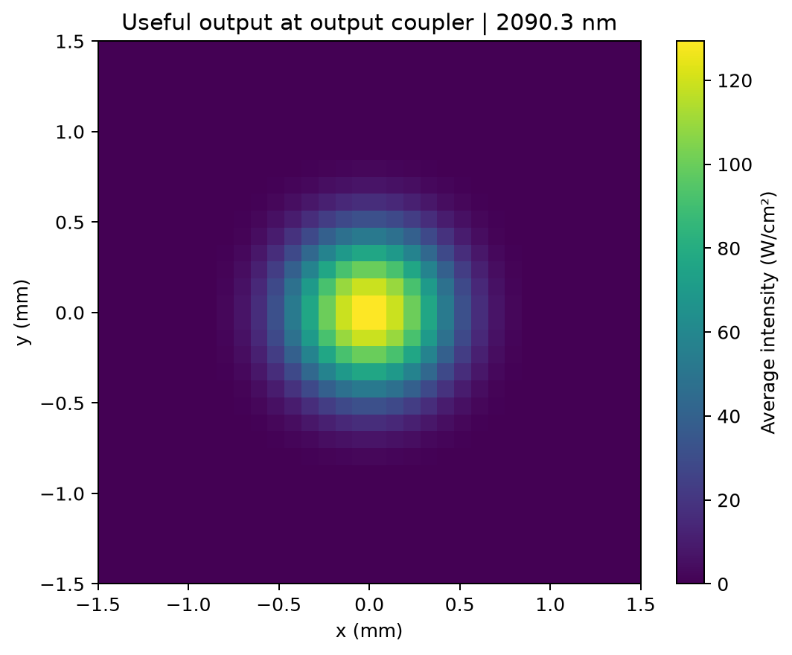

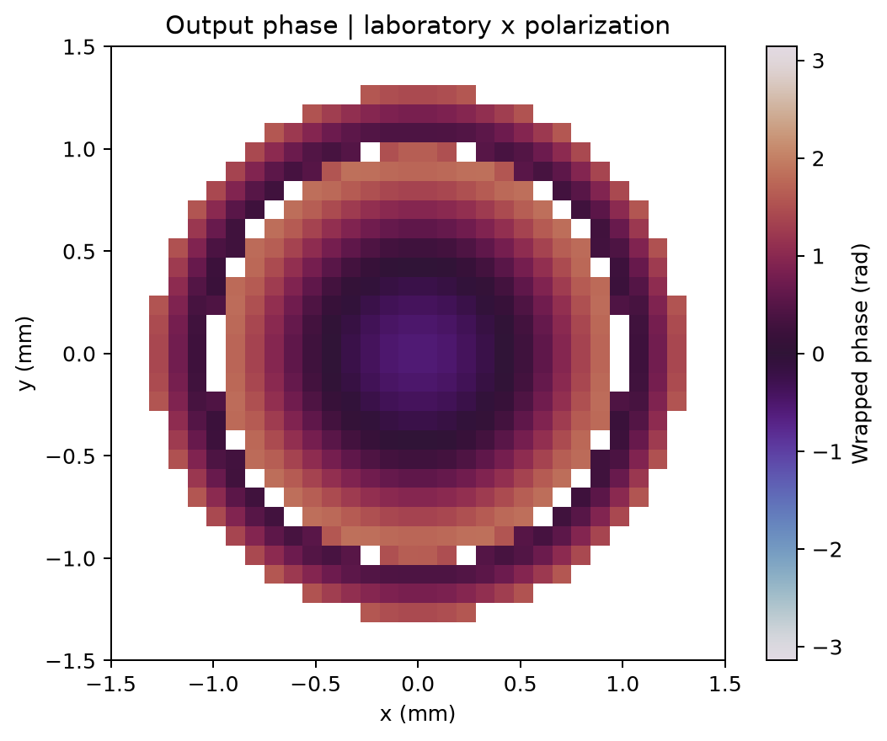

Global optical phase is arbitrary; the phase map masks low-intensity pixels.

---

## 5. Energy flow and heat generation

The local small-signal coefficient is

\[
g=\sigma_{e,L}N_7-\sigma_{a,L}N_8.
\]

The lattice heat ledger is

\[
Q_\mathrm{lattice}
=
P_\mathrm{pump,net}
-
P_\mathrm{stimulated}
-
P_\mathrm{fluorescence}
-
\frac{\partial U_\mathrm{ions}}{\partial t}.
\]

For the audited 10 W reference:

| Cycle-averaged quantity | Power |
|---|---:|
| Incident pump | **10.000000 W** |
| Pump absorbed in crystal | **2.205720 W** |
| Pump escaping | **7.750210 W** |
| Pump mirror/relay loss | **0.044070 W** |
| Stimulated transfer to signal | **0.958425 W** |
| Fluorescence leaving ionic subsystem | **0.574883 W** |
| Deposited lattice heat | **0.671996 W** |
| Residual ionic-storage change | **0.000346 W** |
| Useful output-coupler power | **0.753013 W** |

Stimulated transfer and useful output are not independent terms in one pump partition; intracavity loss and photon storage lie between them.

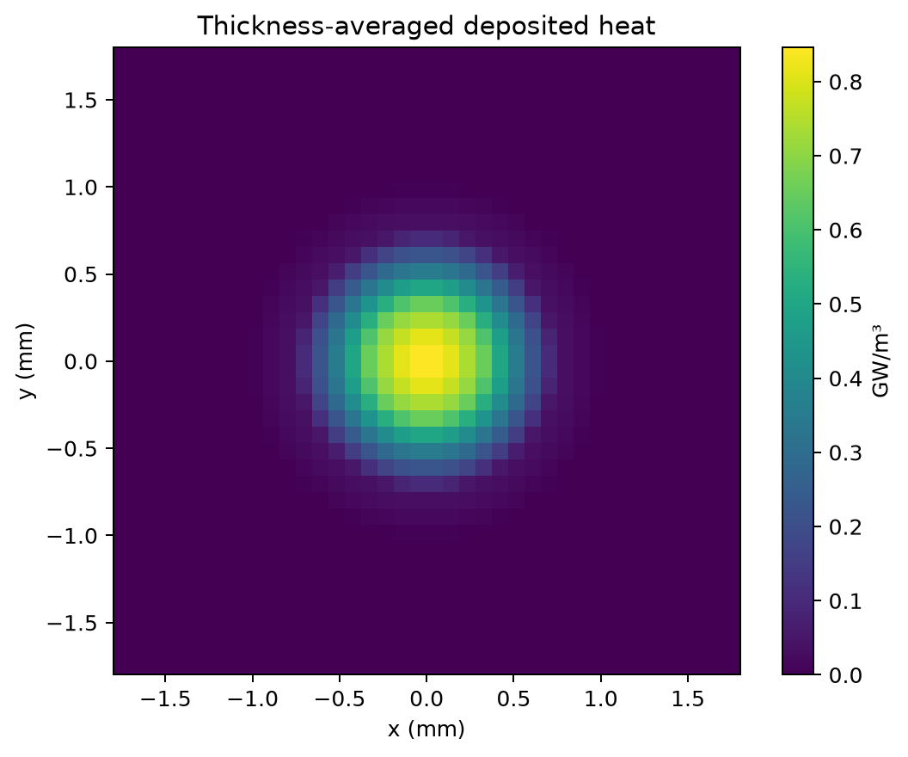

---

## 6. Crystal and cooling-plate thermal simulation

The two solids satisfy

\[
\rho C_p\frac{\partial T}{\partial t}
=
\nabla\cdot(k\nabla T)+Q.
\]

Heat crosses the crystal–plate interface through a finite conductance and crosses the plate–coolant boundary through another finite conductance.

For the archived final relaxed heat source:

- maximum crystal cell temperature: **302.36 K = 29.21 °C**;
- maximum copper-plate temperature: **293.67 K = 20.52 °C**.

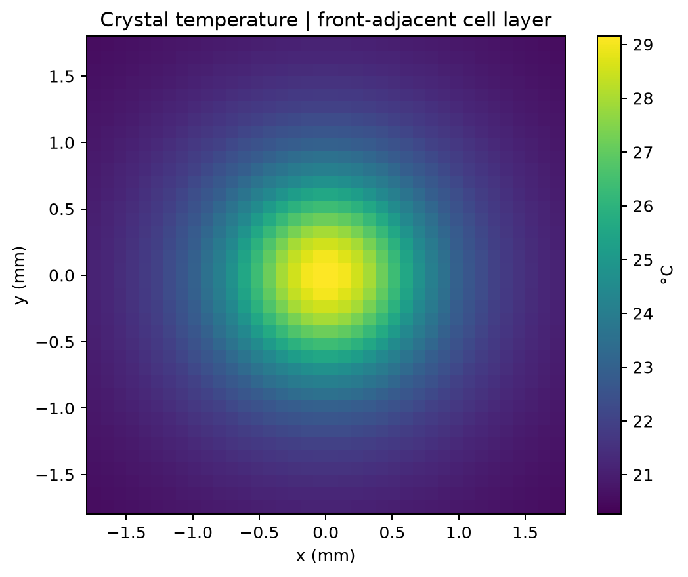

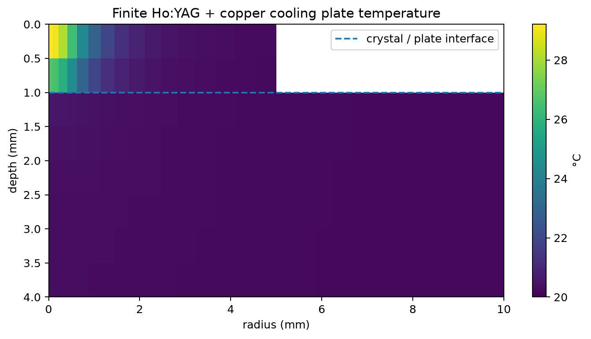

The plate is therefore neither rigid nor isothermal. The contact and coolant conductances are assumptions until calibrated to the real mount.

---

## 7. Thermo-mechanical deformation

Both crystal and plate satisfy linear thermoelastic equilibrium,

\[
\nabla\cdot\boldsymbol{\sigma}=0,
\qquad
\boldsymbol{\sigma}
=
\mathbf C:
\left[
\boldsymbol{\varepsilon}
-
\alpha(T-T_0)\mathbf I
\right].
\]

A compliant bond transfers normal and shear traction. The crystal rear face is not directly fixed.

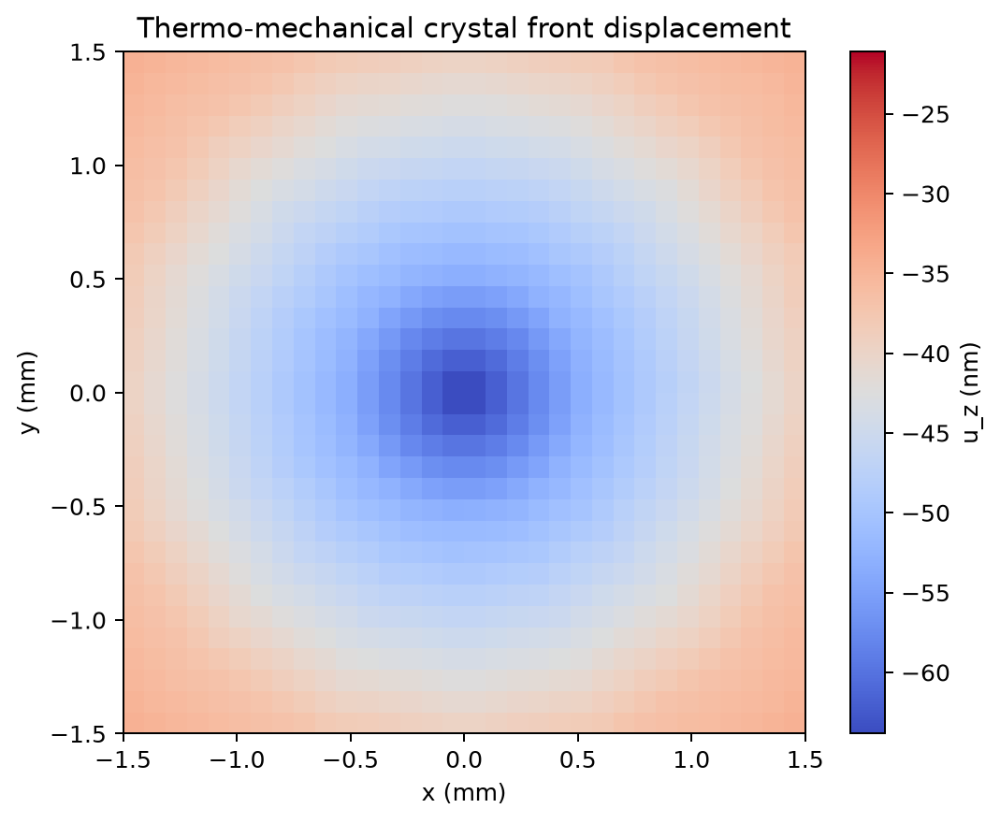

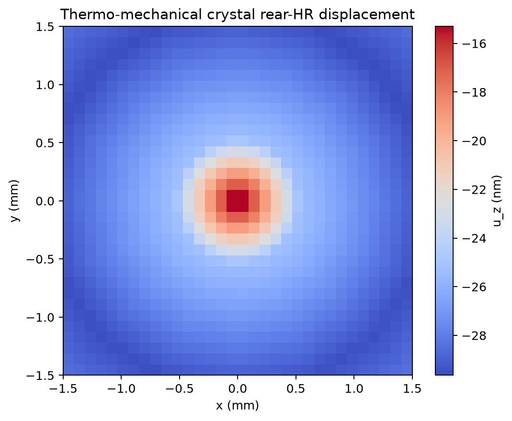

Positive \(z\) points from the optical front into the cooling plate. The interface is currently a **bilateral compliant bond**; opening, Coulomb friction, delamination, solder plasticity and creep are not solved.

---

## 8. Hot-disk optical-path distortion

The reflected optical distortion includes:

1. thermo-refractive index change;
2. motion of both crystal surfaces;
3. stress-induced photoelasticity/birefringence.

For the rear-coated disk, the geometric reflected optical path is

\[
\Delta\mathrm{OPD}_\mathrm{geom}
=
2\left[(1-n)u_{\mathrm{front},z}+n\,u_{\mathrm{rear},z}\right].
\]

Thus twice the front-surface bulge is not sufficient.

The photoelastic response is an ordered two-polarization Jones operator. Current photoelastic coefficients are host-YAG reference values, not a complete measured Ho:YAG 2.09 µm tensor.

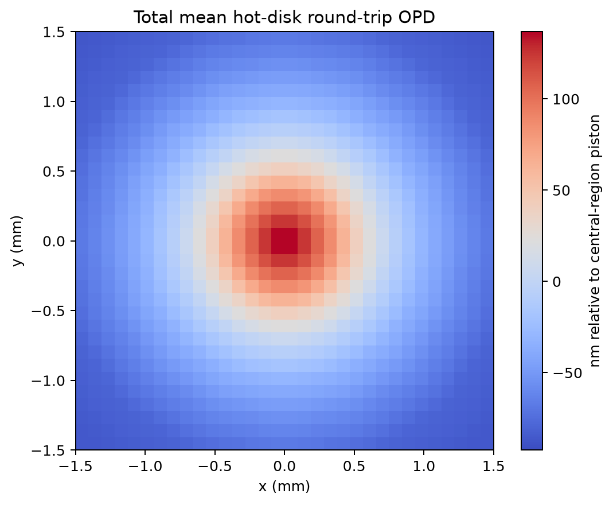

---

## 9. Coupled hot-cavity convergence

The outer loop recomputes

\[
\mathbf E
\rightarrow N_i
\rightarrow Q
\rightarrow T
\rightarrow (\boldsymbol{\sigma},\mathbf u)
\rightarrow \mathbf E_\mathrm{new}.
\]

The corrected audited reference converged in **six outer iterations**:

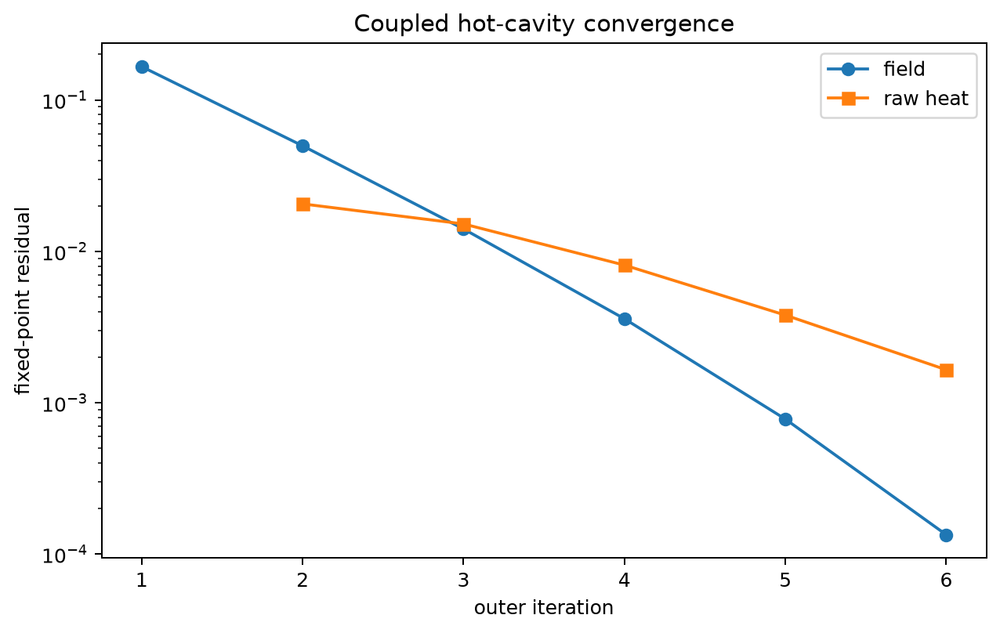

| Residual | Final value |
|---|---:|
| Phase-aligned vector-field residual | **1.34 × 10⁻⁴** |
| Unrelaxed heat-source residual | **1.65 × 10⁻³** |
| Maximum temperature change | **6.68 × 10⁻³ K** |
| Maximum displacement change | **5.67 × 10⁻¹¹ m** |
| Output-power relative change | **2.61 × 10⁻⁴** |
| Full-grid eigenpair residual | **4.39 × 10⁻¹⁴** |

These establish fixed-point convergence on the selected discretization, not complete mesh or mode-count convergence.

---

## 10. Temporal output

The pump pulse is 10 ps, but the model contains no mode-locking mechanism. The optical output therefore need not be picosecond.

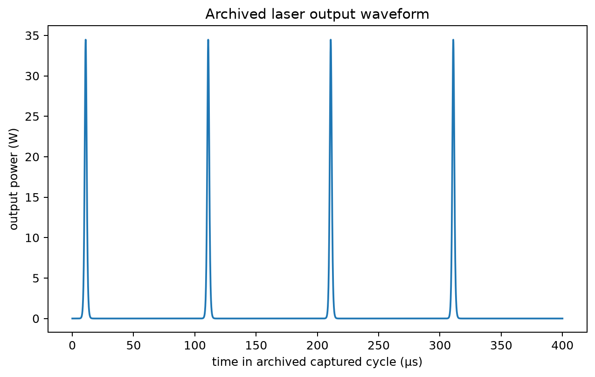

The plotted waveform is the archived cycle from the corrected Stage 7 reference.

---

## 11. Seeded spiral-light diagnostic

A seeded vortex amplifier test and spontaneous free-running vortex selection are different questions.

The following uses the final archived hot operator with a seeded \(LG_0^1\) input at the cavity waist:

| Input | Output after one hot round-trip operator |
|---|---|
| 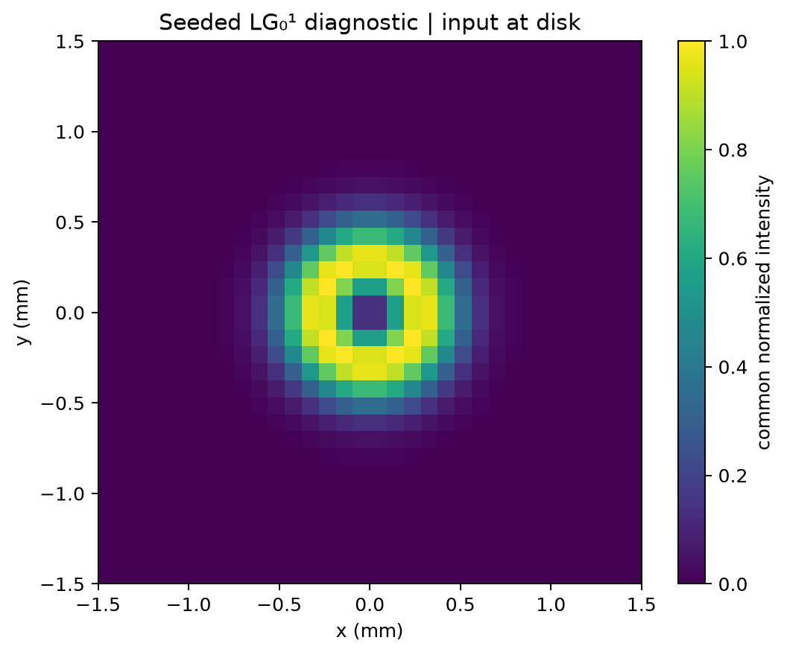 | 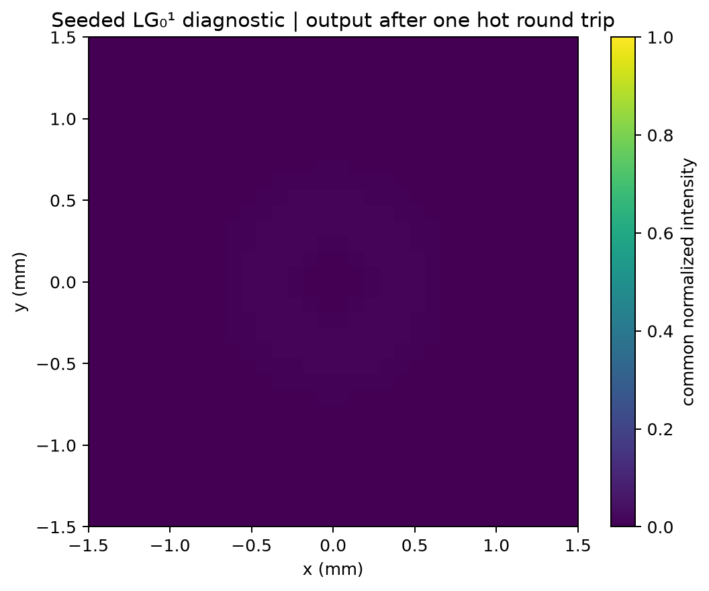 |

This is a weak seeded diagnostic. It is **not evidence that the free-running resonator selects stable LG₀¹ lasing**. Multiple retained eigenbranches are supported, but complete multimode stability and mode-count refinement remain outstanding.

---

## 12. Audit and software status

A deep Stage 0–7 audit found real software/interface defects, including population-axis mismatch, phase loss in a weak-reference diagnostic, pump-duration/spectrum decoupling, FFT detuning-sign inconsistency, insufficient parameter validation, unsafe evanescent evaluation and density-statistics violations.

Those defects were corrected in API 0.8.

The correction campaign recorded:

- **219 tests passed**;
- **19 independent audit probes passed**;
- the corrected 10 W Stage 7 reference again converged in six outer iterations.

Relevant documents:

- docs/AUDIT_STAGE0_7_20260922.md — original failure report;
- docs/AUDIT_FIXES_STAGE0_7.md — corrections and migration;
- docs/STAGE7.md — coupled hot-cavity definition;
- docs/STAGE6.md — crystal/cooling-plate mechanics;
- docs/STAGE5.md — heat and thermo-optic model.

---

## 13. Remaining limitations

This model is not yet a hardware-calibrated digital twin.

Key unresolved items:

- full optical/material/mechanical mesh refinement;
- retained-mode completeness and nonlinear multimode stability;
- coherent mode beating and round-trip-by-round-trip transverse mode evolution;
- measured crystal–plate thermal contact, bond stiffness, preload and coolant coupling;
- unilateral contact/opening/friction/delamination/plasticity;
- complete temperature-dependent Ho:YAG spectroscopy;
- radiation trapping and fluorescence reabsorption;
- coating absorption/heating and coating-layer stress;
- a fully validated Ho:YAG photoelastic tensor at 2.09 µm;
- fully spectrally resolved saturated broadband pump propagation.

For these reasons, the project still marks the current hot-cavity state as **not yet qualified for NN training-label generation**.

---

## 14. Figure provenance

The figures in this README are regenerated in GitHub Actions from the exact audited Stage 7 verification artifact produced by the API-0.8 correction workflow.

The documentation build:

1. downloads that immutable Actions artifact;
2. copies the compact Stage 7 summary/history/audit record into docs/results_readme/data;
3. uses its archived converged field, populations and heat;
4. recomputes the finite crystal/plate thermo-mechanical state required for visualization using the current Stage 6 implementation;
5. post-processes the archived field through the final hot optical operator;
6. records SHA-256 provenance;
7. does **not** solve a new nonlinear oscillator fixed point.

Raw multi-megabyte NPZ arrays remain in the Actions artifact rather than being duplicated in the repository.

See docs/results_readme/figures/manifest.json and docs/results_readme/data/derived_metrics.json.

---

## 15. Reproduce

Clone the repository and install:

    git clone https://github.com/aidasmik/Ho-YAG-crystal.git
    cd Ho-YAG-crystal
    python -m pip install -e '.[dev,plots]'

Run the full tests and independent audit:

    python -m pytest -q
    python audit/deep_check.py

Run the coarse coupled reference:

    python examples/stage7_hot_cavity.py --quick --require-converged --output results/stage7/demo

The README figures can be rebuilt from the unpacked audited Actions artifact:

    python docs/results_readme/generate.py \
      --artifact-root /path/to/unpacked/audited/artifact \
      --output docs/results_readme

---

## 16. Core reference

M. Rupp, M. Eichhorn, C. Kieleck, *Iterative 3D modeling of thermal effects in end-pumped continuous-wave Ho³⁺:YAG lasers*, **Applied Physics B 129, 4 (2023)**, DOI 10.1007/s00340-022-07939-z.

That paper validated a different CW rod geometry. It does **not** directly validate the reconstructed picosecond-pumped thin-disk system documented here.

---

## 17. Bounded local work and scientific replay

The local development path now has a persistent run supervisor,
finite-bank polarization-family diagnostic, and immutable solver snapshots.
Use [the local execution guide](docs/LOCAL_EXECUTION.md) for named bounded
cases, [profiling evidence](docs/PROFILING.md) for measured replay changes,
and [Stage 7W](docs/STAGE7W.md) for the coupled polarization guard.

The replay viewer reads hash-verified scientific arrays using optional
PyVista/VTK dependencies. Its cavity state is an incoherent modal mixture:
it displays per-mode phase and power plus total intensity, not a unique total
phase. Outer iterations carry `time_kind=outer_iteration`; they are not thermal
or optical physical seconds. A separate externally seeded amplifier API in
`hoyag.seeded_amplifier` updates one shared crystal population state across
declared disk encounters. Hardware topology and seed parameters are still
incomplete, so that API does not claim a calibrated multipass design.

Historical Stage 7W results above remain tied to their saved revisions.
Local software, bounded numerical, viewer, full-campaign, experimental, and
dataset statuses are reported separately in `docs/STAGE7W_RESULTS.md`.

An additional weak seeded-probe gallery plots absolute input/output irradiance
and masked relative phase for Gaussian, LG(0,+1), LG(0,+2), HG(1,1), a
Bessel-Gaussian needle, and an order-8 super-Gaussian flattop. It uses the
saved Stage 7W population fractions and an explicit
seeded random Ho concentration with rich and poor clusters of mixed sizes.
The output plane is one 1-mm disk traversal plus 0.25 m free space. It does
not re-solve the pump, heat, or mechanics after changing the dopant map.
Run `.venv/bin/python examples/structured_beam_gallery.py` to regenerate
`results/structured_beams/input_output_beams.png`, `beam_side_profiles.png`,
`beam_on_ho_density.png`, and `ho_density.png`. The overlay uses the generated
entrance-slice Ho concentration as the background and calculated input
irradiance contours as the beam footprint.
`--phase-mask` selects `none`, `vortex+1`, `vortex-1`, `vortex+2`,
`defocus`, `astigmatic`, or `axicon`; the ideal applied phase and unchanged
immediate SLM irradiance are saved in `phase_mask.png`. Centerline input/output
horizontal and vertical irradiance cuts for all six modes are saved beside the
corresponding input and output maps in `input_output_beams.png` and collected in
`beam_side_profiles.png`.
The precomputed choices can also be browsed in
`results/structured_beams/index.html`; regenerate an arbitrary random seed
with the CLI.

To use the interactive calculator, start the local app:

```bash
.venv/bin/python examples/structured_beam_app.py
```

Then open <http://127.0.0.1:8780/results/structured_beams/index.html>. Choose
the phase mask, mask strength, seeded random Ho cluster distribution, and
output distance, then press **Calculate**. Each run writes plots and metrics
under `results/structured_beams/runs/<run-id>/`. The calculator performs a
bounded weak-probe traversal using archived Stage 7W population fractions; it
does not claim a new self-consistent pump, thermal, or mechanical solution.
Select **Modal thermal estimate** in the calculator (historical CLI identifier
`--solver-mode full_seeded_modal`) to compute a saturated fixed-mode oscillator
background, then its heat, cooling plate, thermoelastic displacement, and
photoelastic Jones screens for the selected Ho map. Each displayed 1 W beam
is a separate undepleted one-pass probe of that background. The probe power
does not affect populations or heat, and hot optics do not feed back into the
oscillator. This is an estimate rather than a complete seeded amplifier or
self-consistent cavity solution. It is bounded by the local supervisor and
can take substantially longer. The supervisor records each run and enforces
its own time and memory limits without a cumulative attempt limit.

# Yb:YAG closed-loop correction

The native Yb:YAG tab includes a bounded measurement-only structured-light
correction episode with physical forward solves and correction playback. See
[Yb:YAG closed-loop instructions](docs/YBYAG_CLOSED_LOOP.md) for controls,
run commands, validation metrics and model limits.
