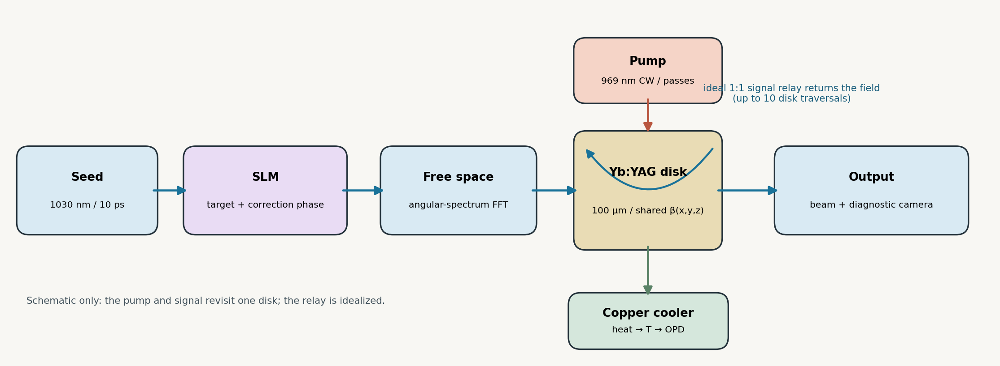
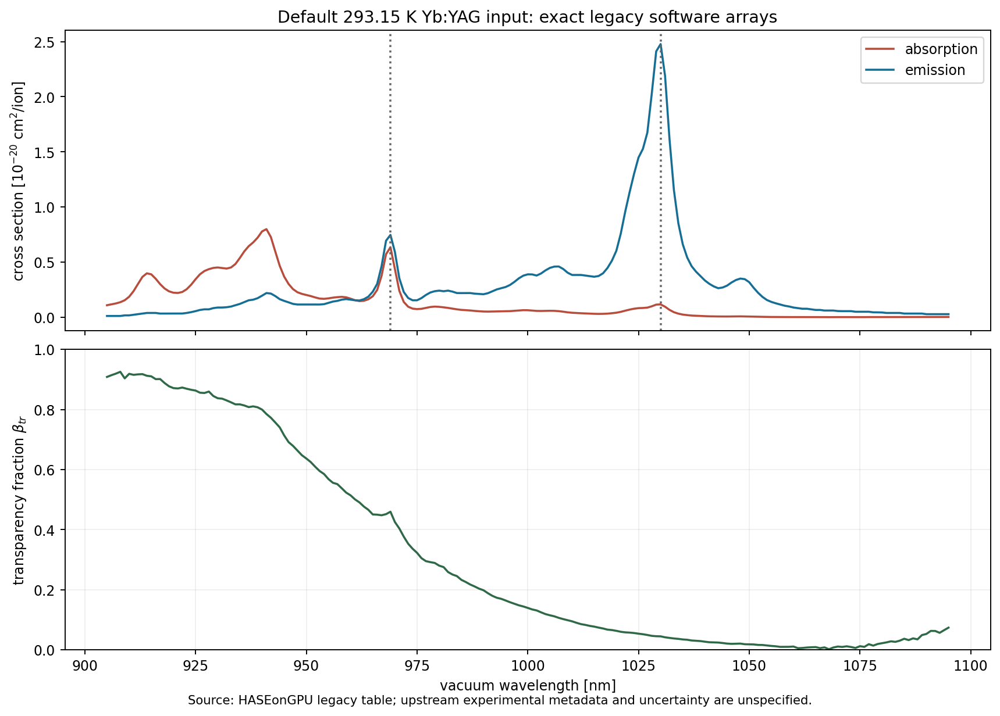
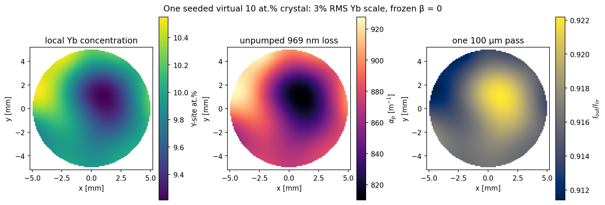
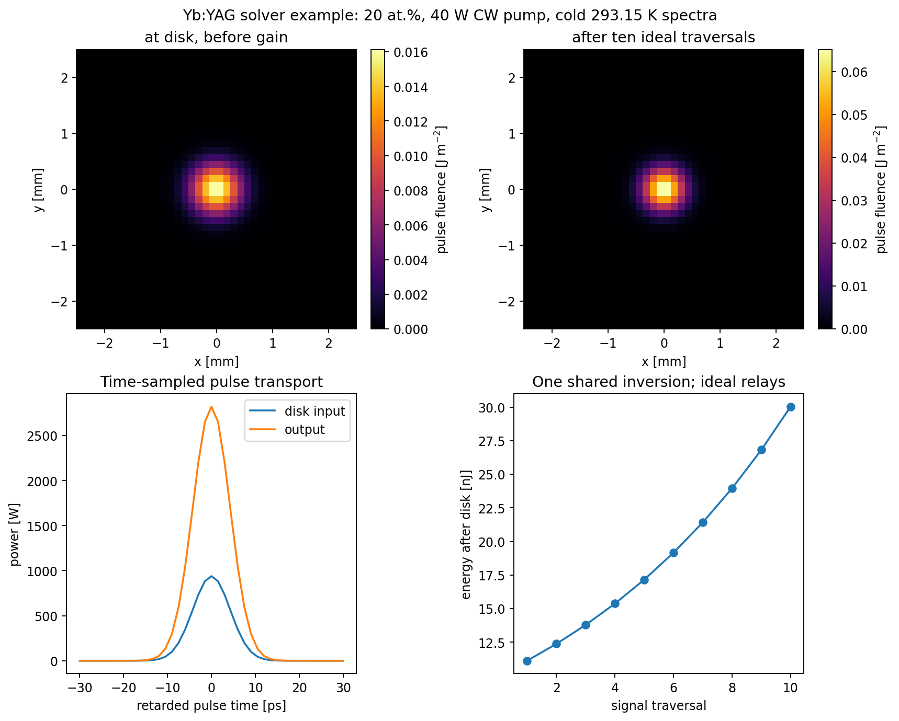
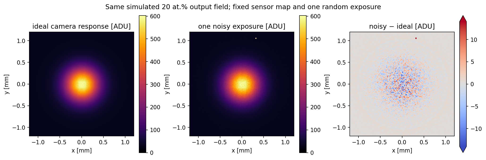

# Yb:YAG thin-disk amplifier simulator

This repository's primary simulation is the **Yb:YAG thin-disk amplifier**.
It follows a shaped seed, a continuous-wave pump, one shared Yb:YAG crystal,
cooling and simulated observations. The [complete Yb:YAG guide](Yb-YAG/README.md)
contains source attribution, all implemented equations, reproduction commands,
figures and limitations.

The repository also retains distinct [Ho:YAG](docs/HOYAG_LEGACY_REFERENCE.md) and
[Yb:LuAG](Yb-LuAG/README.md) models. Their spectra, equations and historical
results are not Yb:YAG validation data.

## Yb:YAG thin-disk amplifier in brief

The Yb:YAG model sends a shaped **1030 nm, 10 ps seed** through one 100 µm disk
up to ten times while a separate **969 nm continuous-wave pump** excites the
same Yb population. A phase-only SLM shapes the seed before it diffracts to the
disk. Pump absorption and signal extraction also provide heat input to a finite
disk, contact and copper-cooler calculation. The relay in this diagram is an
ideal optical boundary condition, not a constructed multipass layout.



### Spectra, concentration and light transport

The default calculation uses a **293.15 K**, 191-point absorption/emission
cross-section table. The pump and signal wavelengths are sampled from those
curves. Optional literature-derived temperature and ceramic concentration
spectra are shown separately in the [full guide](Yb-YAG/README.md#what-data-are-used-now);
they are not silently substituted for the default table.



Nominal doping is atomic percent of Y sites. The code converts it to ion density
as `N = (3 rho_YAG / M_YAG) N_A (at.% / 100)`. For local upper-manifold fraction
`beta`, each optical cell uses

```text
pump absorption: alpha_p = N[(1-beta) sigma_a,p - beta sigma_e,p]
signal gain:     g_s     = N[beta sigma_e,s - (1-beta) sigma_a,s]
I_p,out = I_p,in exp(-alpha_p Delta z);  I_s,out = I_s,in exp(g_s Delta z).
```

The pump alternates direction across axial passes, with relay loss; its
cell-average intensity sets excitation rates. The population bleaches pump
absorption, is depleted by seed extraction, and recovers between pulses. The
solver repeats seed periods until the pre-pulse population becomes periodic.
All signal traversals use **one shared crystal**, not ten independent gain
stages.

### How the amplification calculation runs

The state variable is `beta[z, y, x]`, the fraction of Yb ions in the excited
manifold in each axial slice and transverse optical-grid pixel. If `h nu_p`
and `h nu_s` are pump and signal photon energies, the **per-ion** rates used by
the code are

```text
W_up   = sigma_a,p I_p/(h nu_p) + sigma_a,s I_s/(h nu_s)
W_down = sigma_e,p I_p/(h nu_p) + sigma_e,s I_s/(h nu_s)
d beta/dt = (1-beta) W_up - beta W_down - beta/tau.
```

Here `tau` is the upper-manifold lifetime. Signal absorption can **increase**
`beta`; stimulated emission from pump or signal can **decrease** it. For one
short time step the code holds the computed rates constant and uses the bounded
exponential update

```text
R = W_up + W_down + 1/tau;    beta_eq = W_up/R
beta(t+Delta t) = beta_eq + [beta(t)-beta_eq] exp(-R Delta t).
```

At each cell, the current `beta` sets the absorption/gain coefficients above.
The code transports intensity through the axial slices using their exponential
transmission, and uses the **exact Beer–Lambert cell-average intensity** for
the local rates. It repeats this for every sample of the 10 ps seed pulse and
every traversal. During those short signal windows the pulse kernel sets pump
intensity to zero;
between injected pulses it sets signal intensity to zero, recomputes the
bleached multipass CW pump over eight recovery substeps, and repeats whole
pulse periods until the pre-pulse `beta[z,y,x]` converges.

**Are pixels calculated separately?** For the *ideal pulsed multipass* gain
step, yes: each `(y,x)` column has its own pump intensity, concentration,
population and signal intensity. Cells in that column are linked because the
light leaving one axial slice enters the next. Neighboring columns do not
exchange population or diffract into one another *inside that thin-disk pulse
step*. The SLM-to-disk and optional output propagation use a transverse
angular-spectrum FFT, so pixels mix **before/after** the disk; the CW solver
also diffracts between slices, and the regenerative cavity diffracts between
round trips. Lateral heat flow couples thermal cells on a separate mesh.

After each ideal signal traversal the output fluence
`F_out(x,y) = integral I_s,out(t,x,y) dt` scales the complex field amplitude by
`sqrt(F_out/F_in)`. The code keeps its optical phase, applies the configured
disk phase and relay, then starts the next traversal using the **updated same
population**. Pulse energy is the area sum
`E_out = sum_(x,y) F_out(x,y) Delta x Delta y`.
The figure examples use only **64×64 pixels, one axial slice and 41 pulse-time
samples**; those grids are illustrative, not a convergence claim. The
[full pulse and pump derivation](Yb-YAG/README.md#physical-model-from-source-beam-to-output)
also describes the distinct regenerative and CW algorithms.

Synthetic doping has two paths: the gallery can draw seeded **3D rich/poor
clusters**; the camera dataset and controller instead draw a fixed smooth **2D
map** for each virtual crystal and set the 3D cluster contrast to zero. The
default 2D map is a Gaussian-filtered, zero-mean, unit-RMS random field with
`s_Yb = max(0.1, 1 + 0.03 u)`. Local density is `N_local = N_nominal s_Yb`
(times the optional 3D multiplier), and a separate thickness scale multiplies
each cell's optical depth. The same Yb map also changes the approximate local
thermal conductivity. These are generated imperfections, not measured maps.



For the illustrated 10 at.% map, active-disk concentrations span about
**9.21–10.55 at.%** and the *unpumped, frozen-population* 969 nm one-pass
transmission is **0.911–0.922**. The working amplifier is different: its
population, pump bleaching and signal gain change during repeated encounters.
The full guide plots the [frozen transmission beside periodic solver results](Yb-YAG/README.md#how-light-crosses-varying-concentration).

### Example outputs and observations

In the coarse **cold optical** example, a 40 W pump and 10 nJ seed yield these
calculated pulse energies after ten signal traversals. Per-ion cross sections
are held fixed while nominal doping changes.

| Yb on Y sites | Pump absorbed | Output energy |
|---:|---:|---:|
| 5 at.% | 9.46 W | 14.01 nJ |
| 10 at.% | 17.10 W | 18.88 nJ |
| 15 at.% | 23.17 W | 24.36 nJ |
| 20 at.% | 27.87 W | 30.04 nJ |



Heat is computed from absorbed pump energy minus signal transfer,
fluorescence escape and stored-population change, then passed to a disk/plate
thermal and mechanical model. Its scalar phase screen can be applied to the
output in a near-room-temperature mode; **hot temperature feedback into gain
is unavailable**. A separate 0.1 W thermal example and its phase map are in
the [full guide](Yb-YAG/README.md#heat-cooler-and-phase).

The dataset can add fixed Yb, thickness, surface, contact, SLM and detector
imperfections; varying pump/seed conditions; and per-exposure jitter, Poisson
photoelectron counts, read noise and ADC clipping. Two camera planes,
four-step interferometry, temperature probes and a photodiode provide simulated
observations for control. The controller receives those measurements, while
the NN dataset explicitly includes the known relative Yb map in its inputs.
The [camera example](Yb-YAG/README.md#noise-cameras-and-control) shows one
noisy exposure of the calculated output.

**Scope:** these are sensitivity calculations, not calibrated predictions for
a particular crystal or laser. The default spectra lack sample-specific
uncertainty and hot pump-band data; the examples use coarse spatial/axial
grids, ideal relay optics and synthetic defect/noise maps. Hot gain, ASE,
nonlinear pulse effects and a validated device cooler are unresolved. Read the
[limitations](Yb-YAG/README.md#what-the-current-model-cannot-establish) before
using the figures for design or training targets.

To verify the source files and regenerate the figures from the repository root:

```bash
python -m pip install -e '.[plots,dev]'
python Yb-YAG/tools/verify_manifest.py
python examples/run_ybyag_readme_supervised.py
```

## Run the Yb:YAG simulator

Install from the repository root with Python 3.10+ and Tkinter for the desktop
window:

```bash
python -m pip install -e '.[desktop,dev]'
python examples/ybyag_desktop.py
```

The **Yb:YAG** tab opens first. It offers ideal multipass, regenerative and CW
calculations, source/disk/output maps, pulse and gain traces, pump curves,
camera exports, a grouped NN dataset generator and a measured correction loop.
Runs use the shared local supervisor and budget ledger; the GUI reports time
and memory limits. The [Yb:YAG simulation guide](docs/YBYAG_SIMULATION.md),
[dataset workflow](docs/YBYAG_NN_DATASET.md) and
[closed-loop workflow](docs/YBYAG_CLOSED_LOOP.md) describe the corresponding
inputs and controls. A saved display is a replay of a prior run, not a fresh
calculation.



The camera figure is a synthetic observation of a calculated field. The
full guide explains photoelectron statistics, detector defects, jitter,
interferometry and what the controller can actually measure.

## Code and data

| Path | Purpose |
|---|---|
| [`Yb-YAG/`](Yb-YAG/README.md) | Attributed Yb:YAG material files, manifest and detailed guide. |
| `src/ybyag/` | YAG material dispatch and assembly properties. |
| `src/ybyag_dataset/`, `src/ybyag_control/` | Synthetic observations, grouped trials and measured correction. |
| `src/ybluag/` | Shared two-manifold Yb transport plus the separate LuAG material path. |
| `src/hoyag/` | Ho:YAG model and shared numerical utilities used by the Yb solvers. The Ho-specific physics remains named for Ho:YAG. |
| `examples/ybyag_desktop.py` | Primary desktop launcher. |
| `examples/ybyag_readme_figures.py` | Settings and code for the figures above. |

The distribution is named `ybyag-sim`; import the Yb:YAG material package as
`ybyag`. The separate `hoyag` and `ybluag` modules keep their material names
because they still implement those models. They are dependencies or optional
comparison paths, not alternate names for the Yb:YAG crystal.

## Validation status

The source manifest checks provenance hashes, and tests check software and
selected physical invariants. The example outputs use coarse grids and
engineering assumptions. No temperature-dependent pump spectrum for the
selected Yb:YAG concentration is available here, so **fully coupled hot gain
is disabled**. Spectroscopy, lifetime, cooler/contact, coating, noise and
spatial defects need measurements of a real assembly before the plots can
support quantitative design or NN ground-truth claims. See the
[full limitations and missing-data list](Yb-YAG/README.md#what-the-current-model-cannot-establish).

Historical Ho:YAG coupled-resonator stages remain available in the
[archived Ho:YAG reference](docs/HOYAG_LEGACY_REFERENCE.md) and the
[`src/hoyag/`](src/hoyag/) implementation. Their 2.09 µm results describe a
**different laser**, not the Yb:YAG amplifier shown in this README.
