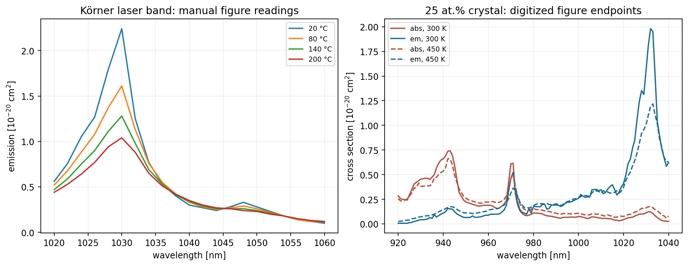
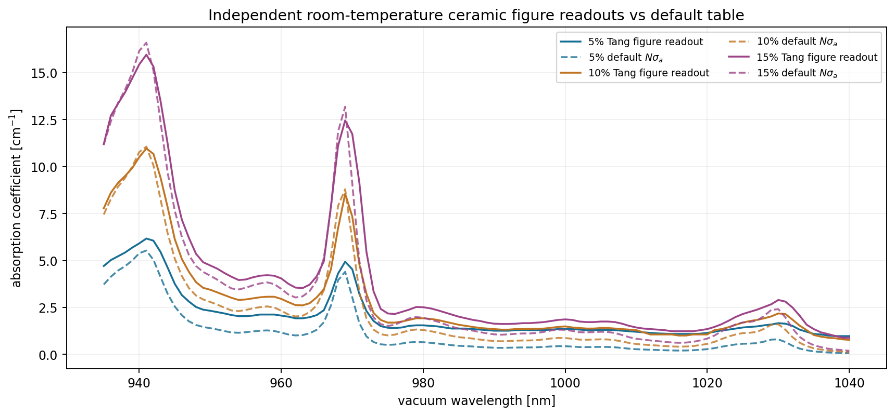
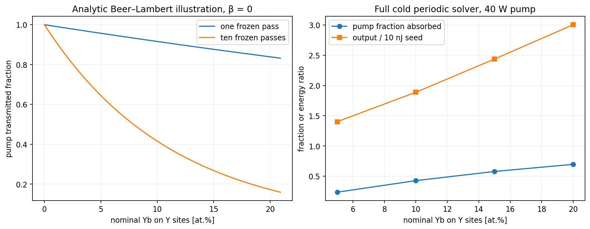
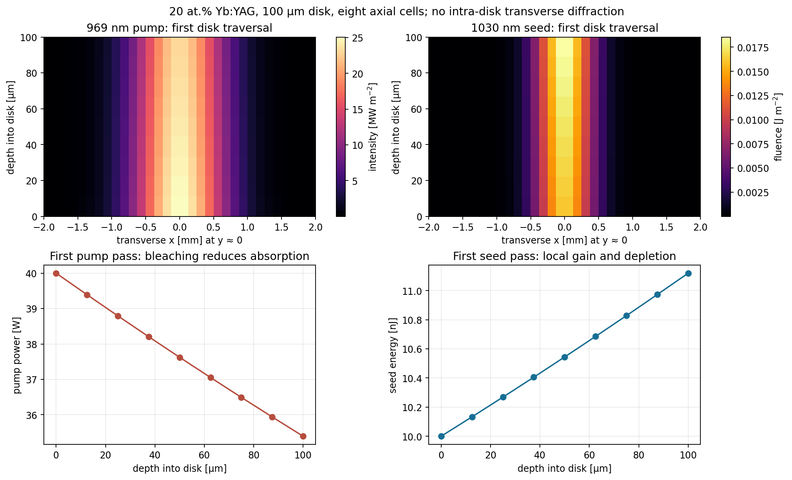
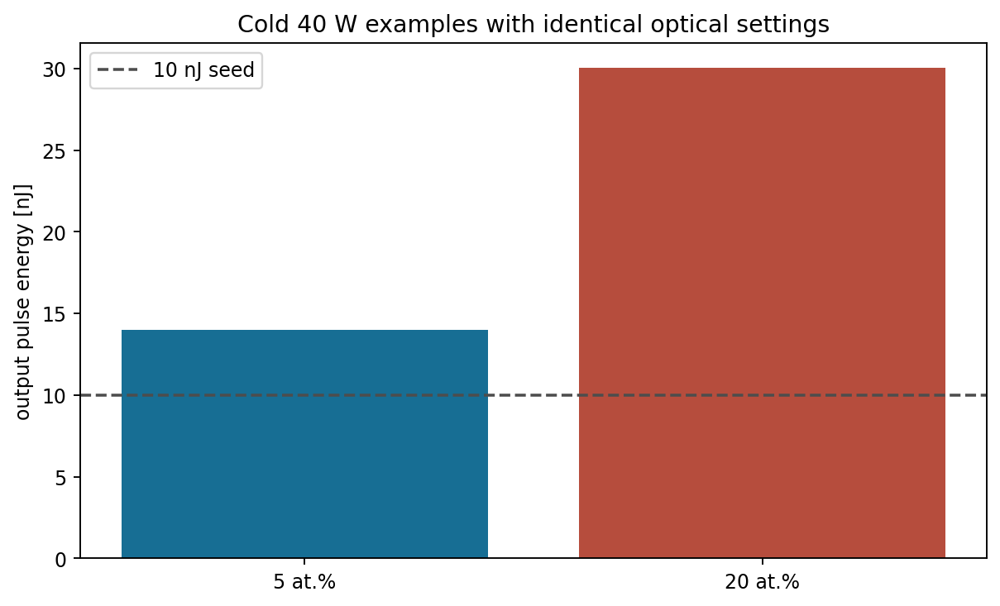
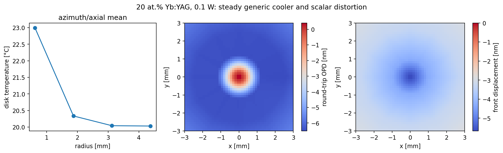

# Yb:YAG data and thin-disk simulator

This guide covers the **Yb:YAG** material package and the Yb:YAG paths in the
[Yb-YAG-crystal repository](https://github.com/aidasmik/Yb-YAG-crystal). It
explains the source spectra, the physics the code actually solves, how to
reproduce example runs, and what remains unvalidated. The Yb:YAG solver reuses
generic two-manifold Yb and thin-disk kernels but supplies its own YAG
spectroscopy, density, index and thermal property choices. Ho:YAG's four-manifold
laser and Yb:LuAG's material spectra are separate models.

**Status:** this is a development and sensitivity model. Neither the material
table nor the simulated output is a calibrated prediction for a particular
crystal, coating, mount or laser. The example figures below were regenerated on
29 September 2026 using solver revision `aab887d` and the figure script in this
repository. Their settings and numerical outputs are in
[simulation_summary.json](readme_figures/simulation_summary.json).


*Figure 1 — the actual software path in the ideal multipass calculation.* The
1030 nm seed receives an SLM phase, diffracts to the disk, and repeatedly
passes through **one** crystal. A separate 969 nm continuous-wave pump revisits
the disk. The model updates one shared excitation field between signal passes
and between pulses. Pump absorption and signal extraction create heat for the
disk, contact and copper calculation; the outgoing optical field can then be
formed into camera observations. The drawn relay is a schematic boundary
condition, not the geometry of a built device.

This guide follows that path: [data](#what-data-are-used-now),
[doping map](#how-the-doping-map-is-made),
[transmission](#how-light-crosses-varying-concentration),
[pulses and heat](#physical-model-from-source-beam-to-output),
[noise and observations](#noise-cameras-and-control), and
[limitations](#what-the-current-model-cannot-establish).

## Reproduce the data and figures

From the repository root, with Python 3.10+:

```powershell
python -m pip install -e '.[plots,dev]'
python Yb-YAG/tools/verify_manifest.py
python Yb-YAG/tools/export_dataset.py --output Yb-YAG/readme_figures/exported_data
python examples/run_ybyag_readme_supervised.py
python -m pytest Yb-YAG/tests tests/test_ybyag_simulation.py tests/test_ybyag_dataset_distortions.py tests/test_ybyag_dataset_sequence.py tests/test_ybyag_control.py -q
```

The source files are already in `Yb-YAG/` and byte-identical runtime copies
are in `src/ybyag/data/`. The first command installs the project; the manifest
command checks all **28** source-file hashes. The exporter makes SI-unit CSV/NPZ
files, without acquiring new measurements. The figure runner uses
`hoyag.local_supervisor`, the shared persistent budget ledger, a 180 s run
limit and a memory cap. It writes figures, a JSON summary, and execution
records to `Yb-YAG/readme_figures/`. The expanded five-case local run takes
about **8 s** and **225 MB** peak process RSS on this machine; these are
machine-specific, not physical time scales.

For the native calculator, run `python examples/ybyag_desktop.py` from the
repository root with a Python installation that includes Tkinter. The Yb:YAG
tab offers ideal multipass, regenerative and CW calculations and shows the
available cold and near-room-temperature lumped-phase modes. Inputs in the UI
are engineering choices; the saved result is not a fresh calculation. See
[native simulation details](../docs/YBYAG_SIMULATION.md),
[closed-loop control](../docs/YBYAG_CLOSED_LOOP.md) and
[the NN dataset workflow](../docs/YBYAG_NN_DATASET.md).

## What data are used now?

The **default numerical amplifier** reads the 191-point, 1 nm spaced,
293.15 K absorption and emission cross sections from
[`yb_yag_293K_legacy.csv`](spectra/yb_yag_293K_legacy.csv). These are exact
arrays from [HASEonGPU](https://github.com/ComputationalRadiationPhysics/haseongpu/tree/5af022b40635b6cf22178252e243467d3d7aed90/material_library/data/legacy_yb_yag),
but their original experimental sample, doping, errors and processing history
are unspecified. Exact copying does not make them a calibrated measurement for
the proposed disk. Cross sections are per ion in cm² in the source CSV; the
runtime converts to m².


The 969 nm pump and 1030 nm signal are *sample points on these same curves*.
The lower panel shows the local small-signal transparency threshold
$\beta_{\mathrm{tr}}=\sigma_a/(\sigma_a+\sigma_e)$; it is not a measured excited-state
population. Narrow-band pump performance depends strongly on actual diode
linewidth and temperature-dependent zero-phonon-line shape, neither of which
the current amplifier integrates.

Additional source families are available for **comparison or explicit opt-in**:

| Source | Coverage and use | Why it is separate |
|---|---|---|
| [Tang et al. 2014](../research/ybyag/tang2014/README.md) | Figure-read room-temperature absorption coefficients for 5, 10 and 15 at.% ceramics, 935–1040 nm | Sample-level `alpha`, not an independent per-ion cross-section table; not added to the default loss. |
| [De Vido et al. 2020](../research/ybyag/devido2020/README.md) | Original 80–300 K scans and quality-flagged 969 nm reconstruction, 1.1 at.% ceramic | Strong ZPL comparison; different concentration and limited spectral span. |
| [Körner et al. 2012](spectra/korner2012_laser_band_manual.csv) | Coarse manual laser-band readings, 1020–1060 nm at 20/80/140/200 °C | Emission is figure-read and absorption is derived by same-temperature McCumber reciprocity; no hot pump band. |
| [Esmaeilzadeh et al. 2012](../research/ybyag/high_temp_25at/README.md) | 300/450 K figure readouts for a 25 at.% crystal | Guarded exploratory 25 at.% lookup; not a 5–20 at.% hot calibration. |



The left panel has only the 1020–1060 nm emission band, so it cannot supply
the hot 969 nm pump coefficient. The right panel comes from a different,
25 at.% specimen. Neither plot is substituted for the default 5–20 at.%
room-temperature table in the amplifier examples.



This comparison is a useful scale and shape check. The dashed curves are
$N_{\mathrm{Yb}}\sigma_a$ from the default table, while the solid curves include the
particular Tang ceramics and figure-reading uncertainty. Their differences
should not be fitted away by silently adding another loss term.

## How the doping map is made

There are **two spatial-map paths**, depending on how the simulation is
launched. In both cases, a nominal `yb_at_percent` defines the mean ion density
through the Y-site formula below. A map changes that density *locally*; it does
not swap in measured cross sections for each local concentration.

1. The native structured/CW and pulsed gallery can make a seeded **three
   dimensional cluster field** through `nonuniform_density` in
   `src/hoyag/structured_beam_gallery.py`. It sums positive and negative
   Gaussian-rich/poor clusters of different transverse and axial widths,
   standardizes their variation over the disk, computes a positive multiplier
   $\exp[\operatorname{clip}(c\,u,-0.55,+0.55)]$, and normalizes it so the
   arithmetic mean density over active disk voxels equals the chosen nominal
   density. The seed, cluster count, contrast and width range are settings.
   The `YbGallerySettings` defaults include a 0.27 contrast. This is a
   **synthetic heterogeneity model**, not a microscopy reconstruction.
2. The NN dataset and closed-loop controller instead set that cluster contrast
   to **zero** and draw one fixed smooth **two dimensional Yb scale map** per
   virtual crystal using `sample_material`. A seeded normal random image is
   Gaussian-filtered with `reflect` edges, mean-subtracted, and divided by its
   own RMS. For a grid with shape `(ny,nx)`, the Gaussian width is
   $\max(2,\min(n_y,n_x)/7)$ pixels. With the default configuration, the scale is
   $s_{\mathrm{Yb}}(x,y)=\max\{0.1,1+0.03u(x,y)\}$, where $u$ has zero mean and unit
   RMS over the sampled grid. One seed generates four independent fields:
   Yb concentration, thickness, background absorption and rear-surface
   figure. The crystal, contact, SLM calibration and camera pixel maps stay
   fixed across that setup's measured trials. A new setup gets new seeds.

For the dataset path, the optical-slice density becomes

$$
\begin{aligned}
N_{\mathrm{local}}(x,y,z)
  &=N_{\mathrm{nominal}}s_{\mathrm{cluster}}(x,y,z)s_{\mathrm{Yb}}(x,y),\\
s_{\mathrm{optical}}(x,y,z)
  &=\frac{N_{\mathrm{local}}(x,y,z)}{N_{\mathrm{nominal}}}
    s_{\mathrm{thickness}}(x,y).
\end{aligned}
$$

$s_{\mathrm{cluster}}=1$ when cluster contrast is zero. The pulse and pump kernels use
$s_{\mathrm{optical}}$ to scale each slice's optical depth, so the sampled thickness map
affects both resonant absorption and gain. The nominal 100 µm mechanical mesh
is **not physically reshaped** by this thickness map; the code adds a separate
first-order cold phase from the thickness error. Likewise, a 2D local Yb map
is not an independently resolved 3D impurity measurement.


*Figure 2 — one seeded map, used as an explanation.* At a nominal 10 at.% the
3% RMS scale makes values from about **9.21 to 10.55 at.% inside this plotted
disk**. With a frozen unexcited population, the local 969 nm one-pass
transmission through 100 µm is about **0.911–0.922**. This is generated from
the same `sample_material` routine, but the figure's local Beer–Lambert
calculation deliberately holds $\beta=0$; the operating solver changes $\beta$.

The other fixed maps have distinct jobs. The default 0.03% RMS thickness scale
is about 30 nm RMS at 100 µm. Background absorption has a 0.1 m⁻¹ nominal
coefficient and 20% RMS variation; it removes pump power before resonant pump
transport and deposits heat. A 2 nm RMS rear-surface figure contributes static
optical phase. The contact map is sampled on the **thermal polar mesh** with a
20% scale variation and multiplies the disk/plate interface conductance.
These numbers are example generator settings in
[`config/ybyag_nn_dataset.json`](../config/ybyag_nn_dataset.json), not measured
manufacturing tolerances. A user can disable each disturbance family.

## How light crosses varying concentration

The local ion concentration acts on pump and seed at **each transverse pixel
and longitudinal slice**. At a frozen population $\beta$, the code asks the
Yb:YAG material object for $\sigma_a$ and $\sigma_e$ at the chosen wavelength.
For an axial cell of nominal thickness $\Delta z=L/n_z$, the dataset-scaled
optical step is

$$
\begin{aligned}
\alpha_{p,\mathrm{cell}}
  &=N_{\mathrm{nominal}}s_{\mathrm{optical}}
       \big[(1-\beta)\sigma_{a,p}-\beta\sigma_{e,p}\big],\\
g_{s,\mathrm{cell}}
  &=N_{\mathrm{nominal}}s_{\mathrm{optical}}
       \big[\beta\sigma_{e,s}-(1-\beta)\sigma_{a,s}\big],\\
I_{p,\mathrm{out}}&=I_{p,\mathrm{in}}e^{-\alpha_{p,\mathrm{cell}}\Delta z},\\
I_{s,\mathrm{out}}&=I_{s,\mathrm{in}}e^{g_{s,\mathrm{cell}}\Delta z}.
\end{aligned}
$$

The actual code uses the **exact exponential cell-average pump intensity**
when it calculates excitation rates, rather than the arithmetic mean of the
two face intensities. Pump visits alternate axial direction. After each
complete pass, its remaining intensity can be reduced by a configured relay
factor. As $\beta$ rises, stimulated emission at the pump wavelength can bleach
the pump absorption. The local signal can be gained or reabsorbed. The signal
field amplitude is multiplied by the square root of the calculated fluence
ratio, preserving its phase for the next ideal relay. These operations share
one physical population field and converge over many seed periods.

An *unpumped, frozen* analytic illustration would give
$T_p=e^{-N\sigma_{a,p}L}$ for one pass and
$T_{p,10}=e^{-10N\sigma_{a,p}L}$ for ten identical lossless passes. It is useful
for seeing the effect of concentration, but it is **not** the periodically
pumped result: the solver lets the local population, pump bleaching, seed
extraction, losses and transverse overlap change the answer.



*Figure 3 — the distinction in numbers.* The left curves hold $\beta=0$ and
ignore changing intensity overlap. The right curves are fresh 40 W cold
periodic solves at 5, 10, 15 and 20 at.% with the same optical settings.

| Yb on Y sites | 40 W pump absorbed | 10 nJ seed output | Output/seed |
|---:|---:|---:|---:|
| 5 at.% | 9.46 W | 14.01 nJ | 1.40× |
| 10 at.% | 17.10 W | 18.88 nJ | 1.89× |
| 15 at.% | 23.17 W | 24.36 nJ | 2.44× |
| 20 at.% | 27.87 W | 30.04 nJ | 3.00× |

The examples are **cold optical screens at 293.15 K**. The very large
cycle-average pump heat at 40 W is not carried back into their gain spectrum.
The model keeps the same per-ion RT cross sections across these dopings, so
the table is a controlled software sensitivity calculation, not a claim that
a higher concentration will improve a real hot amplifier.

The dataset's spatial map also modifies **local thermal conductivity**. The
optical Yb scale is interpolated onto the disk's polar thermal cells; its local
at.% is passed through the selected Cini conductivity family with explicit
resistivity interpolation. At or below 15 at.% the nominal assembly uses its
CT/15-at.% source choices; near 15 at.% the varying-map path uses a relative
HT concentration slope around the selected nominal value. Above 15 at.% it
uses the HT fit at 300 K. This is a near-room-temperature engineering proxy,
not a measured $k(T,c,x,y)$ field of the particular disk.

## Physical model, from source beam to output

The simulation is an envelope and population model, not an optical-cycle
Maxwell solver. In the pulsed path, it follows one physical Yb:YAG disk through
repeated pump and signal encounters. `YbGallerySettings` defines the Gaussian
seed, SLM phase mask, disk, pump, relay and numerical grids;
`YbYAGMaterial` dispatches YAG properties. `simulate_pulsed_seed` then builds
the source field, propagates to the disk, converges the periodic population,
passes the seed through the amplifier and computes cycle-average heat. A
separate finite disk/copper model can produce temperature, displacement and a
scalar optical path screen.

The Yb concentration is atomic percent on the **Y sites**. The runtime uses a
fixed host-volume conversion

$$
N_{\mathrm{Yb}}=\frac{3\rho_{\mathrm{YAG}}}{M_{\mathrm{YAG}}}
N_{\mathrm{A}}\frac{c_{\mathrm{Yb}}}{100},
$$

where $c_{\mathrm{Yb}}$ is Y-site at.%.

This is a density scaling, not a concentration-dependent spectral model. For
ground and upper-manifold fractions $1-\beta$ and $\beta$, respectively, the
local intensity coefficients are

$$
\begin{aligned}
\alpha_p &=N_{\mathrm{Yb}}\big[(1-\beta)\sigma_a(\lambda_p)
                              -\beta\sigma_e(\lambda_p)\big],\\
g_s &=N_{\mathrm{Yb}}\big[\beta\sigma_e(\lambda_s)
                         -(1-\beta)\sigma_a(\lambda_s)\big].
\end{aligned}
$$

Thus $dI_p/dz=-\alpha_p I_p$ and $dI_s/dz=g_s I_s$ in a frozen cell.
Each pump pass is propagated through the longitudinal cells, with alternating
direction and explicit relay retention. The cell-average intensity is the
exact Beer–Lambert spatial mean for its frozen coefficient, which makes
absorbed photons consistent with the cell-face flux difference. A spatially
resolved continuous-wave pump drives an effective two-manifold rate equation:

$$
\begin{aligned}
\frac{d\beta}{dt} &=(1-\beta)W_{\uparrow}
                    -\beta W_{\downarrow}-\frac{\beta}{\tau},\\
W_{\uparrow} &=\frac{\sigma_{a,p}I_p}{h\nu_p}
               +\frac{\sigma_{a,s}I_s}{h\nu_s},\\
W_{\downarrow} &=\frac{\sigma_{e,p}I_p}{h\nu_p}
                 +\frac{\sigma_{e,s}I_s}{h\nu_s}.
\end{aligned}
$$

With rates fixed over a short time step, the population update is

$$
R=W_{\uparrow}+W_{\downarrow}+\tau^{-1},\qquad
\beta_{\mathrm{eq}}=\frac{W_{\uparrow}}{R},\qquad
\beta(t+\Delta t)=\beta_{\mathrm{eq}}
  +[\beta(t)-\beta_{\mathrm{eq}}]e^{-R\Delta t}.
$$

The source calls the signal part zero during inter-pulse recovery. Recovery
recomputes pump bleaching over eight substeps and iterates successive seed
cycles to a periodic pre-pulse inversion. The short seed is transported on a
retarded-time intensity grid; pump evolution during the picosecond seed window
is neglected. Gain and reabsorption update the same population after each
disk traversal. In the **ideal multipass** architecture, a 1:1 phase-preserving
relay returns the field for up to ten signal traversals. `pump_passes` and
`signal_traversals` count different paths; their values need not match.

**Spatial resolution:** the ideal pulsed kernel stores `beta[z,y,x]` and
calculates local rates and gain at every optical-grid pixel and axial slice.
Axial cells in each `(x,y)` column are linked by the pump and seed intensity
passed from cell to cell. The pulsed gain step has no transverse diffraction or
population diffusion between neighboring columns. An angular-spectrum FFT
mixes the field transversely on the SLM-to-disk and optional output paths;
the separate structured-CW solver diffracts between axial slices, while the
regenerative path diffracts over cavity round trips. The heat solver couples
neighboring locations through conduction on a different mesh. Thus the model
does not treat the entire calculation as independent pixels.



*Figure 4 — first-pass beam penetration, from the pump and pulsed transport
kernels.* An eight-slice, 100 µm, 20 at.% cold disk uses a 40 W Gaussian pump.
The first pump pass is evaluated with its converged pump-only excited fraction
frozen: 40.00 W enters and 35.39 W leaves. A 10 nJ seed then crosses the same
eight cells once, with local population depletion, and leaves at 11.12 nJ.
The top panels show the centerline profiles at cell faces; the lower panels
integrate each face over $x,y$. There is no transverse diffraction inside this
pulsed disk step. The graph is **one pump pass and one seed pass**, not the
final periodic ten-pass output shown below. The disk is still one shared
physical crystal.

The **regenerative** option follows a different optical map. Each round trip
visits the same disk twice, propagates a complex field to a curved mirror and
back with an angular-spectrum FFT, and applies the finite aperture, HR,
hold, injection and extraction losses. Its short-pulse cell extraction uses
the two-manifold Frantz–Nodvik relation

$$
\begin{aligned}
F_s&=\frac{h\nu_s}{\sigma_{a,s}+\sigma_{e,s}},\\
g_0&=g_{s,\mathrm{cell}}\Delta z,\\
F_{\mathrm{out}}&=F_s\ln\!\left[1+e^{g_0}
                    \left(e^{F_{\mathrm{in}}/F_s}-1\right)\right].
\end{aligned}
$$

The implementation evaluates this stably at large fluence, then changes
$\beta$ from the photon transfer. This branch resolves fluence and round trips;
it does **not** return a computed output pulse temporal shape. The ideal
multipass branch does return a time-sampled intensity trace. A shaped SLM
field changes intensity only after propagation or filtering when the mask is
phase-only.


In this **cold** example, 40 W of 969 nm continuous-wave pump illuminates a
100 µm disk through ten pump passes. A 10 nJ, 10 ps seed at 1030 nm traverses
the 20 at.% disk ten times. The 64×64, one-axial-cell calculation returns
**30.04 nJ** at the output plane. The pulse-power curve is a calculated
retarded-time intensity trace, not optical carrier oscillations or a chirp
prediction. The energy curve shows repeated use of the same population, not
ten independent amplifiers.



At 5 at.% the same setup returns **14.01 nJ**. At 20 at.% it returns
**30.04 nJ**. These comparisons hold the per-ion spectrum fixed as
concentration changes; they do not include concentration quenching, hot
gain, damage, ASE or a calibrated relay. More doping cannot be interpreted
as a proven device improvement from this plot.

## Heat, cooler and phase

The code forms a **cycle-average lattice heat ledger** from the pump photons
absorbed in the disk, energy transferred to or absorbed from the signal,
escaping fluorescence and change in stored excitation:

$$
P_{\mathrm{heat}}=P_{\mathrm{pump,absorbed}}
 -P_{\mathrm{signal,gain}}-P_{\mathrm{fluorescence,escaped}}
 -\frac{dU_{\mathrm{excitation}}}{dt}.
$$

`fluorescence_escape_yield` is an effective assumption; the README examples
use zero. At the cold 20 at.%, 40 W operating point the code reports about
**27.87 W pump absorption** and **30.04 nJ output energy**. It does not run a
valid hot-gain calculation at that heat load. Pump absorption is an optical
ledger item, not proof that the generic mount can remove that power.

For the thermal calculation, the finite disk and copper plate solve a heat
diffusion/conduction problem of the form
$\rho C_p\,\partial T/\partial t=\nabla\!\cdot(k\nabla T)+Q$,
with finite disk/contact and plate/coolant conductances. The mechanical model
solves linear thermoelastic equilibrium $\nabla\!\cdot\boldsymbol\sigma=0$
with thermal eigenstrain. The scalar round-trip
optical path combines temperature-dependent index and front/rear surface
movement. In `lumped_phase` mode that phase is applied **after** optical
amplification; gain still uses 293.15 K spectra. The code does not apply the
available cubic photoelastic tensor in this scalar Yb:YAG amplifier.

For a dataset thickness perturbation $\Delta L=L(s_{\mathrm{thickness}}-1)$,
the **one-traversal** cold geometric phase is
$\phi_L=(2\pi/\lambda_s)(n_{\mathrm{YAG}}-1)\Delta L$. A modeled rear-HR
height $h$ adds $(2\pi/\lambda_s)h$ per encounter in the symmetric thin-disk
convention: a reflected $2h$ path is shared by two traversals. The thermal model supplies a
round-trip OPD from thermo-refractive change and surface displacement. Its
post-amplifier phase uses the configured number of encounters and half the
round-trip OPD per encounter. These approximations do not solve oriented
photoelastic birefringence or a measured surface profile.



This separate **0.1 W**, 20 at.% case gives about **0.0827 W** absorbed pump,
a **23.08 °C** maximum crystal cell temperature, and a calculated scalar OPD
map for the generic cooler. At this very low pump the output is **7.28 nJ**:
the seed is partly reabsorbed. This demonstrates that a gain coefficient can
be negative below transparency. The thermal example uses the generic 20 °C
coolant boundary and near-room-temperature property proxies; it is not the
steady temperature of the 40 W case.

## What happens to the optical field

The source is a complex Gaussian envelope normalized so its squared magnitude
integrates to the requested pulse energy. At the SLM plane, an intentional
phase target and any correction are added to that field. For example, the
vortex target uses azimuthal phase `atan2(y,x)`, the needle target uses a
converging radial axicon phase, and the flat-top target is made by 48
alternating-projection steps. Those names describe **requested disk-plane
patterns**: no target is promised to be an exact pure textbook mode.

The ideal phase-only operation is

$$
E_{\mathrm{after\ SLM}}(x,y)=E_{\mathrm{Gaussian}}(x,y)
e^{i\phi_{\mathrm{applied}}(x,y)}.
$$

Its intensity at that plane is unchanged. A scalar angular-spectrum FFT then
propagates it over the configured SLM-to-disk distance; the intensity pattern
can change there. The disk receives a separately normalized Gaussian pump,
$I_p(x,y)\propto\exp\!\left[-2\big((x-x_p)^2+(y-y_p)^2\big)/w_p^2\right]$,
with its integral set to
incident pump watts. The selected seed pulse has a Gaussian **intensity**
envelope sampled at 41 retarded-time points from `-3` to `+3` pulse FWHM;
its discrete integral is normalized to the requested seed joules.

The ideal multipass pulse kernel transports *intensity* in each axial cell,
updates its local Yb population and recovers that population during the dark
part of the repetition period. It uses a coherent transverse field for phase
and output diffraction but does not solve the full space-time complex field
inside every pulse pass. A fixed cold disk phase is applied per encounter.
In the near-room-temperature `lumped_phase` path, the calculated thermal
round-trip OPD is applied as a single output screen before any requested
post-disk propagation. Consequently its output phase is an approximate
diagnostic; it is not gain reshaping by a hot, continuously deformed cavity.

The `structured CW` route differs from the pulsed route: it transports a
coherent field through axial slices with half-step diffraction and a local
field factor $e^{g\Delta z/2}$. Its `weak_probe` option holds the pump-only
population; `saturated_cw` includes signal intensity in that population;
`modal_cw` has a separate modal background. A CW map in watts is not a pulse
fluence map in joules per square metre. The figure above showing a temporal
pulse comes from the *ideal pulsed* path, not the CW or regenerative path.

| Displayed quantity | Mathematical meaning | Normal unit |
|---|---|---|
| Pump intensity | Incident or cell-face power per area | W m⁻² |
| Seed/output fluence | Time-integrated pulse intensity | J m⁻² |
| Pulse power trace | Spatial integral of retarded-time intensity | W |
| Pulse energy | Integral of fluence over transverse area | J |
| Average optical power | Pulse energy × repetition rate | W |
| Local population $\beta$ | Upper-manifold ions / all active Yb ions | dimensionless |
| Pump attenuation $\alpha$ / signal gain $g$ | Intensity exponential coefficient | m⁻¹ |
| Optical path difference | Phase-equivalent path through/reflected from the disk | m or nm |

The 10 ps trace is a **pulse** coordinate. A 10 kHz seed arrives every 100 µs;
the pump and population recover in that interval. Thermal startup can take
milliseconds or seconds, with optical-cycle heat averaged before the cooler
solve. Outer iterations used to converge a periodic population are numerical
steps, **not** physical elapsed time. By contrast, measured controller trials
carry simulated timestamps; their wall-clock computation time is not the
modeled control period.

## Noise, cameras and control

Noise is **optional** and belongs to different stages. The basic amplifier
examples in this README use a deterministic Gaussian beam and uniform
concentration, then an additional figure passes one solved output through the
camera model. A dataset or closed-loop run enables a larger collection of
fixed material imperfections, changing operating conditions and random
observations. These categories must not be confused:

| Category | Drawn or updated when | Effect in the simulator |
|---|---|---|
| Crystal Yb, thickness, background loss, rear figure | Once per virtual crystal | Local column density, pump heat and cold phase. |
| Contact, external aberration, SLM response, camera PRNU/DSNU and defect pixels | Once per setup/session | Cooling boundary, upstream phase, actual SLM phase and fixed detector response. |
| Pump power/radius/pointing, seed energy/waist/pointing, coolant | Per operating point or chronological update | New physical pump, gain, heat, temperature and output field; ranges come from the selected config. |
| Camera shot/read noise, pulse energy/pointing jitter | Per exposure | New ADU sample of the current solved field. |
| Probe read noise/dropout and photodiode noise | Per observation | Imperfect temperature and output-energy readings, not changes to the true field. |
| Calibration and environmental drift | With simulated elapsed time | Persistent camera gain, SLM or probe changes and, in `in_situ`, carried disk/plate temperatures. |

The default dataset configuration samples 5/10/15 at.% × Gaussian, flat-top,
vortex and needle targets with a 384² optical field and 1920×1080 camera
frames. The latter **resample** an optical field; their pixel count does not
create 1080p physical wavefront detail. Train, validation and test contain
independent complete crystal setups, not neighboring frames from the same
crystal. Stress setups form a separate split. The smaller controller fixture
has its own settings (normally a 48² optical grid and 320×176 cameras), so
its noise and results should not be identified with the 1080p dataset by
name alone.

The image-formation code maps the calculated output **fluence** to camera
object-plane pixels, allows shift/rotation/scale errors, and applies a Gaussian
point-spread function. The expected photoelectrons in a pixel are proportional
to

$$
\mu_{e,\mathrm{signal}}=F_{\mathrm{pixel}}A_{\mathrm{pixel}}
N_{\mathrm{pulses}}\,\eta_{\mathrm{opt}}\,\mathrm{QE}
\frac{\lambda_s}{hc}\,\mathrm{PRNU}_{\mathrm{pixel}}.
$$

It adds dark current, background electrons and then samples a Poisson count;
DSNU and Gaussian read noise are added afterward. Dead and hot pixels are
applied, charge is clipped at the full-well limit and mapped to a finite-bit
ADU with a black level. The pulse-jitter option draws energy and pointing
variation over the exposure, represented by an effective gain, shift and
Gaussian blur; it **does not propagate every pulse separately**. The quoted
5% quantum efficiency at 1030 nm, throughput, point-spread function and pixel
imperfections are illustrative, not a calibration of a named 1080p camera.


*Figure 5 — one 384×216 illustrative observation of the 20 at.% cold output.*
The ideal and noisy panels use the same ADU scale and the same fixed camera
map. The difference panel highlights a fresh exposure noise realization;
its colour range is chosen for normal variation, so rare defect pixels can
clip visually. The code reported zero full-well-saturated pixels in this
example. Neither image is an experimental camera frame.

Two diagnostic arms can be captured at different propagation/astigmatic
conditions. A **single intensity frame cannot reveal optical phase**. The
interferometric control mode adds a calibrated reference arm and takes four
phase-shifted images at `0`, `π/2`, `π`, `3π/2`. Opposite differences recover
the real and imaginary interference terms, with shot/read noise, blur,
quantization and clipping still present. Temperature probes read the solved
disk/plate at five positions through a first-order response, fixed bias,
independent read noise, random-walk calibration drift and possible dropout.
A photodiode energy reading can have separate multiplicative noise.

The live controller receives **only its simulated camera, probe and
photodiode measurements**, not the hidden Yb map, true optical phase or ideal
SLM correction. It may try
interferometric phase updates, a measured local response matrix, SPGD or a
hybrid sequence; rejected measured trials remain in the chronology. The NN
dataset has a different input contract: it includes the **known relative Yb
map**, incoming beam and command metadata alongside its cameras and probes.
It keeps other hidden physical maps and a fresh full-solver-verified candidate
correction as *labels*, separately from measured inputs.
An offline modal error is not a demonstrated improvement of the propagated
output beam. See the [control workflow](../docs/YBYAG_CLOSED_LOOP.md) and
[dataset workflow](../docs/YBYAG_NN_DATASET.md) for the exact candidate
acceptance checks and replay limitations.

## What the current model cannot establish

1. **Hot pump and gain:** the required concentration-resolved pump spectra
   above 293.15 K are absent. `YbYAGMaterial` rejects hot cross-section
   queries and `coupled_steady` Yb:YAG runs. The allowed near-room-temperature
   lumped phase does not feed temperature back into gain.
2. **Sample-specific spectroscopy:** the default RT arrays lack upstream
   sample and uncertainty metadata. Scaling ion density does not account for
   concentration-dependent cross sections, lifetime, defects or quenching.
   The 969 nm pump is modeled monochromatically; diode linewidth and ZPL
   temperature shift can change absorption materially.
3. **Thermal and optical hardware:** doped conductivity is selected from
   published fits or concentration interpolation; host heat capacity,
   expansion, index and thermo-optic values are proxies at most dopings.
   Contact, copper cooler and coating curves need measurements of the real
   assembly. The stated 293.15–300 K thermo-mechanical range is a model
   validity window, not a crystal survival limit.
4. **Missing device physics:** vector photoelasticity and depolarization,
   ASE and parasitic lasing, nonlinear phase, damage, finite switching,
   pulse chirp/compression, spectral gain narrowing and coherent diffraction
   within each picosecond disk pass are not solved. The ideal relay geometry
   is a boundary condition, not a ray-traced multipass layout.
5. **Numerical qualification:** the README runs use 64² transverse pixels,
   one optical axial slice and a coarse thermal mesh. Photon balance checks
   and source hashes are useful software evidence, but a mesh/time-step
   convergence study and experimental comparison are required before using
   output energy, temperature or phase maps for design limits or NN ground
   truth. The newer controller reports offline modal errors; see its
   [explicit qualification limits](../docs/YBYAG_MODAL_MODEL.md) and
   [V2 status](../docs/YBYAG_CONTROLLER_V2.md).
6. **Maps and observations:** the illustrated 3% Yb map, thickness/contact
   variations and detector noise are seeded synthetic draws. They are not
   measured maps of the proposed crystal or calibrated camera transfer
   functions. The optical thickness map does not remesh the mechanics; sensor
   pixels resample a coarser field. Dataset file checks and controller scores
   therefore do not establish experimental training validity.

The most direct next measurements are wavelength-resolved pump and emission
spectra versus temperature **and concentration**, lifetime for the selected
sample, absorbed pump power, disk and cooler temperature maps, calibrated
surface/phase distortion, coating loss and measured output versus pump. See
the [missing-data inventory](../docs/YBYAG_MISSING_DATA_SEARCH.md).

## Code and output map

| Path | Role |
|---|---|
| `Yb-YAG/spectra/`, `thermal/`, `mechanical/` | Attributed material inputs. |
| `src/ybyag/material_data.py`, `src/ybyag/model.py`, `src/ybyag/assembly.py` | YAG-specific lookups, runtime material class and near-RT assembly properties. |
| `src/ybluag/multipass_pump.py`, `pulsed.py`, `regenerative.py`, `gallery.py` | Shared generic Yb pump, population, pulse, cavity and orchestration kernels. Several source docstrings retain LuAG wording; material dispatch selects YAG values. |
| `src/hoyag/structured_beam_gallery.py` | Seeded 3D cluster density reused by Yb gallery paths. |
| `src/ybyag_dataset/distortions/`, `generator.py` | Smooth crystal/contact/optical maps, operating-point variation, SLM/camera/probe observations and grouped dataset trials. |
| `src/ybyag_control/` | Measured controller plant, four-step interferometry and correction methods. |
| `examples/ybyag_readme_figures.py` | Exact settings and plot-generation script used above. |
| `examples/run_ybyag_readme_supervised.py` | Bounded runner and persistent run record. |
| `Yb-YAG/readme_figures/` | Generated figures, SI exports, JSON values and execution log. |

The existing [data provenance notice](provenance/NOTICE.md) and bundled
[GPL text](provenance/COPYING.GPL-3) govern redistribution of the upstream
HASEonGPU arrays and their transformations. The rest of this README describes
the standalone material API in more detail.

## Material API reference

Standalone material inputs for laser/amplifier simulation. **This is a sourced development dataset, not a fully calibrated experimental digital twin or validated neural-network training dataset.** The Yb:YAG runtime uses these data while keeping the Ho:YAG and Yb:LuAG material inputs separate.

## Coverage and evidence

| Quantity | Packaged coverage | Evidence and limitation |
|---|---|---|
| Absorption and emission cross sections | 905-1095 nm, 191 points, 293.15 K | Exact numerical arrays from HASEonGPU. Original experimental provenance, sample doping and uncertainty are not supplied upstream. |
| Temperature-dependent laser-band spectra | 1020-1060 nm; 20, 80, 140, 200 C | 21 coarse manual readings per emission curve from the Korner2012 figure. Absorption is derived by same-temperature McCumber reciprocity. Explicit opt-in required. |
| Temperature-dependent pump spectra | **Not packaged above 293.15 K** | The software refuses to substitute a room-temperature pump spectrum at another temperature. Original numerical arrays remain needed. |
| Thermal conductivity versus temperature and Yb doping | Aggarwal2005: 0, 2, 4, 15 at.%, approximately 100-300 K; Cini2017 fits: CT 80-300 K and HT 300-475 K | Tabulated measurements/derived conductivities and published empirical fits. CT and HT are separate source families, not automatically stitched. |
| Host thermal properties | Sato2025 tables: 100-500 K for Cp, expansion and apparent dn/dT; 160-500 K for conductivity/diffusivity | Undoped-host values, not concentration-specific Yb:YAG measurements. Conductivity fits extend to 773 K. |
| Host optical dispersion | 400-5000 nm | Zelmon1998 room-temperature Sellmeier fit. No doping-dependent dispersion or KK-consistent resonant dielectric model is claimed. |
| Elasticity and photoelasticity | Cubic host room-temperature elastic tensor; legacy complete photoelastic set and conflicting incomplete alternative | Host proxies. No temperature/doping-dependent tensor calibration. Missing p44 in the alternative set stays missing. |
| Stark levels, lifetime, ion density, gain and saturation | Source scalar anchors and explicit formulas | Lifetime is not a calibrated tau(T,c) law. Scaling ion density does not create concentration-resolved cross sections. |

Source identities, locations and qualifications are in `provenance/references.json`. All missing quantities and integration risks are listed in `gaps_and_assumptions.csv`.

## Quick start

From this directory:

```bash
python -m pip install -r requirements.txt
python -m unittest discover -s tests -v
python tools/verify_manifest.py
python tools/export_dataset.py
```

The exporter needs no network access. It writes **ordinary CSV and compressed NPZ files** to `generated/`, including source-temperature spectra in SI units, absorption coefficients for 2/5/10/12/15 at.% and sampled host optical/thermal curves. There are no split binary archives. Generated files are reproducible outputs and are not required to use the module.

```python
from models import yb_yag as yag

# Exact upstream RT tabulation: cm^2 per Yb ion.
sigma_a, sigma_e = yag.cross_sections_cm2(1030.0, temperature_K=293.15)
alpha = yag.absorption_coefficient_m1(940.0, yb_at_percent=5.0)
gain = yag.gain_coefficient_m1(1030.0, yb_at_percent=5.0,
                              excited_fraction=0.20)
n_host = yag.n_yag(1030.0)

# Published high-temperature conductivity fit at a tabulated doping.
k_doped = yag.thermal_conductivity_doped(373.15, 5.0, family='HT')

# Optional, COARSE laser-band sensitivity input; not measured raw arrays.
sa_est, se_est = yag.cross_sections_cm2(
    1030.0, 373.15, dataset='laser_band_figure', allow_approximate=True)
```

A request for `cross_sections_cm2(940, 373.15)` raises an error because the required temperature-dependent pump data are missing. It does not extrapolate, clamp temperature, invent peaks or fall back to RT data. Non-tabulated concentrations in the conductivity fits likewise require explicit `interpolate_doping=True`; that option interpolates thermal resistivity and is an engineering assumption.

## Units and definitions

Temperatures in the API are kelvin. Wavelengths are nm. Spectral source files use cm^2 per Yb ion; transport helpers use m^2, m^-1, W m^-1 K^-1, J kg^-1 K^-1 and Pa. The source thermal tables retain their explicitly named units.

Yb at.% means substitution on the **Y sublattice**, not the fraction of all atoms. The number-density baseline is

$$
N_{\mathrm{Yb}}=\frac{3\rho_{\mathrm{YAG}}}{M_{\mathrm{YAG}}}
N_{\mathrm{A}}\frac{c_{\mathrm{Yb}}}{100}.
$$

It uses the host volume at 300 K. This is not a measured concentration-dependent lattice/density relation. RT doped densities and heat capacities at 0/2/4/15 at.% are supplied separately by `doped_RT_density_heat_capacity()`.

Net small-signal gain is
$g=N[\beta\sigma_e-(1-\beta)\sigma_a]$. The effective two-manifold
saturation fluence is $F_s=h\nu/(\sigma_a+\sigma_e)$, not the emission-only
expression. Saturation intensity additionally depends on the chosen lifetime.
These quantities do not by themselves specify extraction efficiency, ASE
losses, or total heat load.

## Thermal and stress-optic cautions

`thermal_conductivity_host()` and `heat_capacity_host_J_kgK()` describe the YAG **host**. Do not silently use undoped-host conductivity for highly doped material. The Cini CT and HT families can disagree near their boundary because they fit different samples/data; choose a family rather than inventing continuity.

Sato2025 explicitly notes that its apparent dn/dT may include mounting-stress photoelasticity. Access requires `allow_apparent=True`. It is not automatically combined with a separate photoelastic calculation. The older Aggarwal thermo-optic baseline is restricted to 100-300 K. Both dn/dT sources are near 1064 nm; use at 1030 nm requires `allow_wavelength_proxy=True`.

For a stress-free thermo-optic index, apply photoelasticity to **mechanical elastic strain = total strain - thermal eigenstrain**, not to total strain. Otherwise free thermal dilation is counted twice. `photoelastic_delta_B()` accepts mechanical strain in [100]/[010]/[001] axes and uses

$$
\begin{aligned}
\Delta B_{ii}&=p_{11}\epsilon_{ii}
  +p_{12}(\operatorname{tr}\boldsymbol\epsilon-\epsilon_{ii}),\\
\Delta B_{ij}&=2p_{44}\epsilon_{ij},\qquad i\ne j.
\end{aligned}
$$

`B` is the inverse relative dielectric tensor. The tensor choice and coordinate rotation must remain explicit. The alternative Johnson/Olson set has no verified p44 here and is rejected as incomplete.

## Data quality and validation

The four original HASEonGPU text files are preserved in `spectra/haseongpu_original/`; their Git blob hashes are checked by the tests. The merged RT CSV reproduces their values exactly. They are **not** relabeled as Korner2012 raw measurements.

The optional temperature curves are deliberately separate: manual readings from a reproduced authors' figure, rounded values, limited laser-band coverage, no calibrated confidence intervals. The digitization record specifies the viewed page, axis calibration and suggested sensitivity perturbations. Dense interpolation does not create additional experimental resolution.

`QA_REPORT.json` records a local software test and export round-trip. Tests cover source hashes, units, broadcasting, domain failures, gain/transparency, saturation, thermal anchors, elastic symmetries, tensor rotations and photoelastic conventions. **Passing tests does not establish agreement with a real laser.** Before generating quantitative training data, replace the approximate spectra and missing high-T pump data, calibrate the sample/mount and compare gain, temperature and phase maps against measurements.

## Layout

- `material.json`: machine-readable definitions, fit coefficients and domain limits.
- `spectra/`: source RT arrays, merged CSV, coarse temperature nodes, Stark/lifetime anchors.
- `thermal/`: host and doped tables plus separate conductivity-fit families.
- `mechanical/`: elastic and photoelastic tensors with conventions and competing sets.
- `models/`: standalone NumPy material helpers.
- `examples/`: Korner2012 illustrative thin-disk configuration, not an experimental benchmark.
- `provenance/`: source references, digitization record, original-data notice and license.
- `tests/`, `tools/`: bounded validation, manifest verification and export.

No article PDFs, hidden credentials, existing simulator changes, automatic training, or remote compute are included. The upstream HASEonGPU data retain their license; see `provenance/NOTICE.md` and `provenance/COPYING.GPL-3`.
