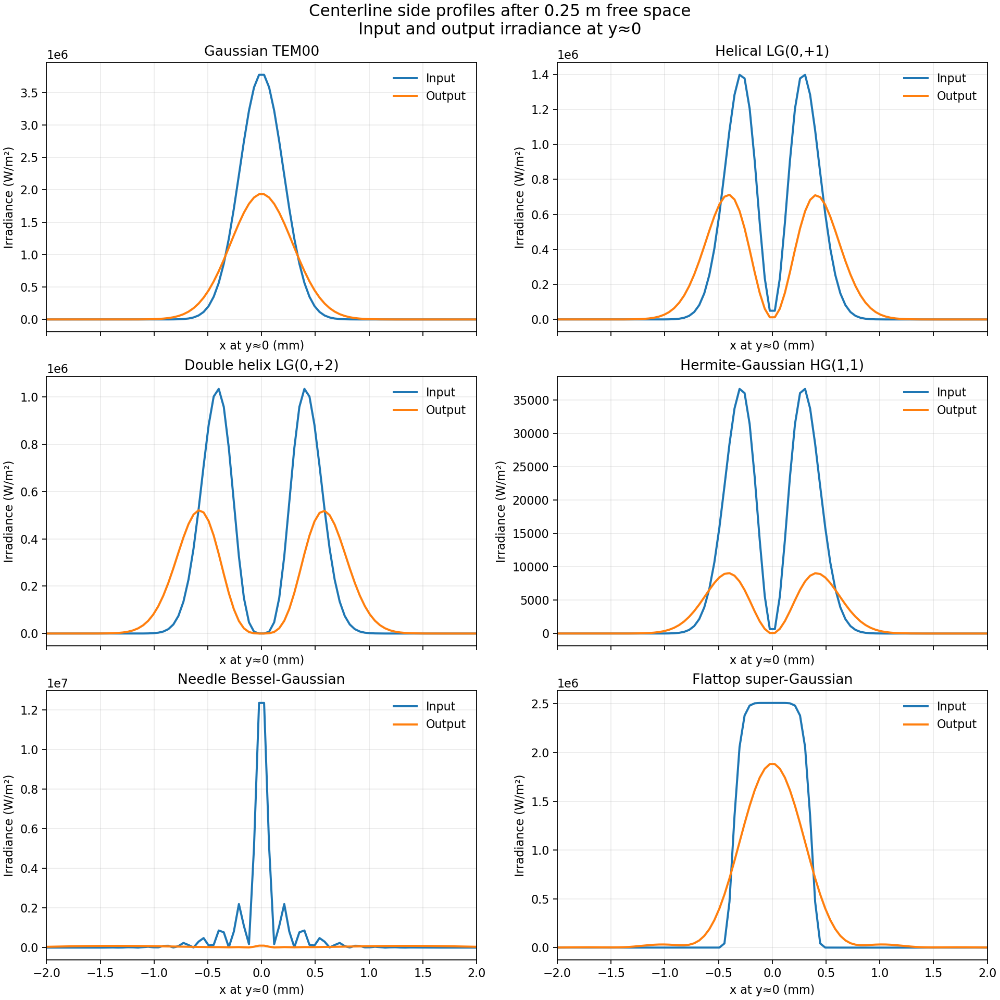
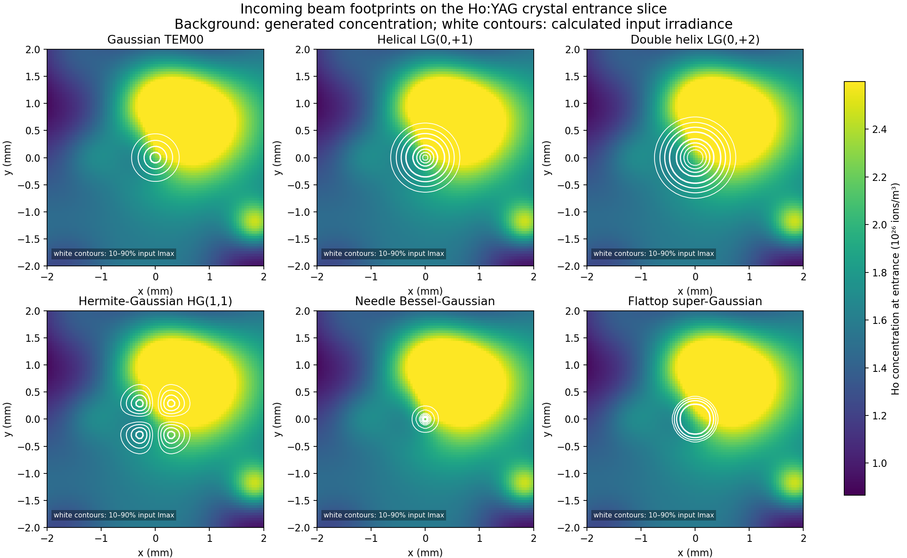

# Structured seed probes through nonuniform Ho:YAG

[Open the phase-mask selector](index.html) for seven precomputed mask choices.

For custom calculations, start `examples/structured_beam_app.py` from the
repository root and open the same page through
`http://127.0.0.1:8780/results/structured_beams/index.html`. The form generates
a new seeded clustered Ho map and applies the selected ideal phase mask when
you press **Calculate**. Results are saved under `runs/<run-id>/`.

The [vortex+1 example](vortex_plus1/input_output_beams.png) shows how a
selected mask changes the propagated output. Its [applied phase](vortex_plus1/phase_mask.png)
is saved separately.

All six inputs have 1 W integrated power at 2.0903 µm: Gaussian, two helical
Laguerre-Gaussian modes, HG(1,1), a Bessel-Gaussian needle, and an order-8
super-Gaussian flattop. The output plane is one 1-mm Ho:YAG traversal followed
by 0.25 m of free-space propagation.
The input/output irradiance panels and their adjacent centerline profiles use
W/m²; phase is masked below 1% of
peak local irradiance and has an arbitrary global phase removed. The helical
LG modes have winding charges +1 and +2; their intensity is not animated as
rotating.

| Seed shape | Output power | Disk power gain |
|---|---:|---:|
| Gaussian TEM00 | 1.0157 W | 1.0157× |
| Helical LG(0,+1) | 1.0120 W | 1.0120× |
| Double helix LG(0,+2) | 1.0049 W | 1.0049× |
| Hermite–Gaussian HG(1,1) | 1.0048 W | 1.0048× |
| Needle Bessel-Gaussian | 1.0045 W | 1.0045× |
| Flattop super-Gaussian | 1.0176 W | 1.0176× |

The imposed Ho concentration has an active-disk mean of 1.52e26 ions/m³
and ranges from 0.865e26 to 2.600e26 ions/m³ for seed 17. It contains
24 seeded Ho-rich and Ho-poor clusters with different transverse and axial
sizes. The saved Stage 7W population fractions
were interpolated and frozen during these weak seeded probes. Pump, heat,
mechanics, saturation, and multipass hardware were not recomputed for the
new concentration. This gallery is a controlled optical illustration, not
a new self-consistent laser operating point.

The calculator also has **Modal thermal estimate** (historical identifier
`full_seeded_modal`). It reuses the audited `ModalThinDiskLaser`,
`sample_cycle_heat`, `PlateAssembly`, and Stage 6 Jones components for the
selected Ho map. One fixed-mode oscillator background supplies saturated
populations and heat. Each input beam is then a separate undepleted one-pass
probe of that shared background. Its power does not change populations or
heat, and the computed hot optics do not feed back into the oscillator. This
does not claim a cavity eigenfield update or a complete seeded amplifier. It
is bounded by the local supervisor and may take longer than the weak probe.
When the four coupled
slots are used, press **Start new bounded compute budget** in the calculator;
the old ledger is archived before a fresh bounded session is opened.

The beam overlay is calculated from each input complex field and the generated
entrance-slice concentration. In this weak-probe model the concentration map
changes only the real scalar gain term, while the archived population fractions
and refractive, thermal, and mechanical states remain frozen. Therefore a new
map can change local amplitude and output power without visibly bending the
wavefront. Shape distortion requires a self-consistent index, thermal,
mechanical solve or a saturated-gain propagation with stronger spatial gain.

Rebuild with `python examples/structured_beam_gallery.py`. Select an ideal
phase mask using `--phase-mask none|vortex+1|vortex-1|vortex+2|defocus|astigmatic|axicon`.
Use `--solver-mode weak_probe` for the fast archived-state probe or
`--solver-mode full_seeded_modal` for the one-way modal thermal estimate above.
The mask does not change irradiance immediately across the ideal SLM.
Exact settings,
source/state hashes, and power values are in `summary.json`; complex fields
and the 3-D Ho map are in the default `fields.npz`. The `vortex+1` example
also includes its complex fields; the other precomputed masks use
`--plots-only` and retain plots and summaries. Rerun a selected mask without
that flag to save its field arrays. The live calculator's modal estimate
completed a bounded default-parameter run on 24 September 2026; each
new Ho map must be computed separately.
